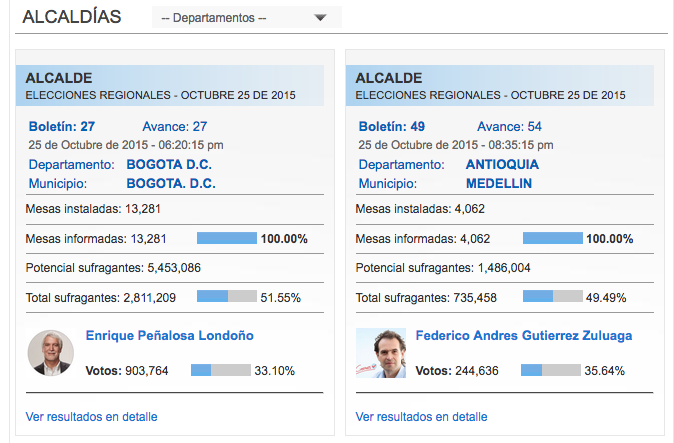

Intentemos recuperar los datos de los resultados de las elecciones a
alcaldías en Colombia en 2015. Si vamos a la página web que [aloja los
resultados](http://www.colombia.com/elecciones/2015/regionales/resultados/),
veremos que los resultado se ofrecen desagregados. En primer lugar,
vemos los datos del ganador:

Pero también podemos ver los resultados de los demás rivales, tanto en
número como en porcentaje, así como los datos de participación y
recuento.

Si investigamos un poco más, podemos ver que los datos están disponibles
en una tabla de HTML. Nuestro objetivo es por tanto navegar el código
fuente de la página para extraer esas tablas.

Pero antes de hacer eso, es importante no solo ver cómo recuperaremos
los datos de cada una de las alcaldías si no si es posible automatizar
la navegación a lo largo de diferentes páginas. Para eso, podemos
comprobar que la dirección contiene los parámetros de búsqueda para el
tipo de elección (`C`), departamento (`D`) y municipio (`M`). De este
modo, podemos pensar en usar las búsquedas que vimos cuando hablamos de
web API:

    library(httr)
    URL <- "http://www.colombia.com/elecciones/2015/regionales/resultados/alcaldia.aspx"
    r <- GET(URL,
             list(C="AL",  ## Alcalde
                  D=9,     ## Caldas
                  M=52))   ## La Merced

Veamos en primer lugar el contenido al que nos enfrentamos:

    res <- content(r, "text") 

El problema es por tanto ver cómo podemos navegar y extraer elementos de
HTML de la página. Para eso, `httr` no nos sirve y tenemos que recurrir
a otro paquete. En este caso, usaremos `rvest`

    library(rvest)
    library(stringr)

Empecemos por leer el contenido de la página

    URL <- "http://www.colombia.com/elecciones/2015/regionales/resultados/alcaldia.aspx"
    URL <- paste0(URL, "?C=AL&D=9&M=52")
    spage <- read_html(URL)
    spage

    ## {xml_document}
    ## <html xmlns="http://www.w3.org/1999/xhtml" xml:lang="es" lang="es" dir="ltr">
    ## [1] <head>\n  <title>ALCALDE: LA MERCED (CALDAS) - Resultados Electorale ...
    ## [2] <body>&#13;\n<!-- Begin -  Site: Colombia.com Zone: Colombia.com - R ...

El paquete nos ofrece funciones para navegar y extraer elementos del
modelo de la página. Por ejemplo, tenemos la función `html_table` que
nos permite recuperar todas las tablas.

    datos <- spage %>%
        html_table()
    datos

    ## [[1]]
    ##   X1 X2
    ## 1 NA NA
    ## 
    ## [[2]]
    ##                  X1                    X2
    ## 1       Boletín: 11                  <NA>
    ## 2           Avance:                    17
    ## 3 Fecha del avance: 25 de Octubre de 2015
    ## 4  Hora del avance:           05:30:15 pm
    ## 5     Departamento:                CALDAS
    ## 6        Municipio:             LA MERCED
    ## 
    ## [[3]]
    ##                       X1    X2       X3
    ## 1        Mesas instalas:    19     <NA>
    ## 2      Mesas informadas:    19  100.00%
    ## 3 Potencial sufragantes: 5,625     <NA>
    ## 4     Votos no marcados:    97    2.56%
    ## 5           Votos nulos:    48    1.27%
    ## 6     Total sufragantes: 3,775   67.11%
    ## 
    ## [[4]]
    ##                   Candidato NA
    ## 1                       001 NA
    ## 2                       005 NA
    ## 3                       003 NA
    ## 4                       002 NA
    ## 5                       004 NA
    ## 6 Total votos por candidato NA
    ## 7           Votos en blanco NA
    ## 8       Total votos válidos NA
    ##                                                                        NA
    ## 1               carlos quintero alvarez\r\n\t\tpartido liberal colombiano
    ## 2        hector fabio perez vasquez\r\n\t\tpartido conservador colombiano
    ## 3             neveth alfredo londoño cano\r\n\t\tpartido opción ciudadana
    ## 4              claudia maria velez mesa\r\n\t\tpartido centro democrático
    ## 5 jaime arturo marin ceballos\r\n\t\tpartido polo democrático alternativo
    ## 6                                                                    <NA>
    ## 7                                                                    <NA>
    ## 8                                                                    <NA>
    ##   Votos Porc. de Votación
    ## 1 2,056            56.63%
    ## 2 1,167            32.14%
    ## 3   148             4.07%
    ## 4   129             3.55%
    ## 5    99             2.72%
    ## 6 3,599            99.14%
    ## 7    31             0.85%
    ## 8 3,630            96.15%

De ahí, nos interesa la tabla número 4.

    datos <- spage %>%
        html_table() %>%
        .[[4]]
    datos

    ##                   Candidato NA
    ## 1                       001 NA
    ## 2                       005 NA
    ## 3                       003 NA
    ## 4                       002 NA
    ## 5                       004 NA
    ## 6 Total votos por candidato NA
    ## 7           Votos en blanco NA
    ## 8       Total votos válidos NA
    ##                                                                        NA
    ## 1               carlos quintero alvarez\r\n\t\tpartido liberal colombiano
    ## 2        hector fabio perez vasquez\r\n\t\tpartido conservador colombiano
    ## 3             neveth alfredo londoño cano\r\n\t\tpartido opción ciudadana
    ## 4              claudia maria velez mesa\r\n\t\tpartido centro democrático
    ## 5 jaime arturo marin ceballos\r\n\t\tpartido polo democrático alternativo
    ## 6                                                                    <NA>
    ## 7                                                                    <NA>
    ## 8                                                                    <NA>
    ##   Votos Porc. de Votación
    ## 1 2,056            56.63%
    ## 2 1,167            32.14%
    ## 3   148             4.07%
    ## 4   129             3.55%
    ## 5    99             2.72%
    ## 6 3,599            99.14%
    ## 7    31             0.85%
    ## 8 3,630            96.15%

Hay todavía bastante trabajo de limpieza que nos quedaría por hacer. Por
ejemplo, nos gustaría eliminar las tres últimas filas, y también
querríamos separar los nombres del partido de los nombres del candidato.
Pero podemos dejar eso para más adelante, cuando veamos las expresiones
regulares. Por hora nos conformaremos con tomar esta información y
dejarla en bruto en algún lado.

El reto ahora es conseguir que nuestro programa pueda navegar a lo largo
de todos los municipios de Colombia. Para eso necesitamos saber el
código que es usado para cada municipio y para cada departamento. Esto
lo podemos recuperar de la propia página.

Si por ejemplo miramos en la cima de la página, veremos que hay un nodo
con clase `menuTopElecciones` que contiene diferentes listas (`<li>`).

    baselinks <- spage %>%
        html_nodes(".menuTopElecciones li")
    baselinks

    ## {xml_nodeset (6)}
    ## [1] <li><a class="hide" href="/elecciones/2015/regionales/resultados/alc ...
    ## [2] <li>&#13;\n<a href="/elecciones/2015/regionales/resultados/gobernaci ...
    ## [3] <li><a class="hide" href="/elecciones/2015/regionales/resultados/alc ...
    ## [4] <li>&#13;\n<a href="/elecciones/2015/regionales/resultados/alcaldia. ...
    ## [5] <li><a class="hide" href="/elecciones/2015/regionales/resultados/alc ...
    ## [6] <li>&#13;\n<a href="/elecciones/2015/regionales/resultados/alcaldia. ...

Si examinamos la página, vemos que nos interesa la cuarta de estas
listas.

    baselinks <- spage %>%
        html_nodes(".menuTopElecciones li") %>%
        .[[4]]
    baselinks

    ## {xml_node}
    ## <li>
    ##  [1] <a href="/elecciones/2015/regionales/resultados/alcaldia.aspx?C=AL" ...
    ##  [2] <a href="/elecciones/2015/regionales/resultados/alcaldia.aspx?C=AL& ...
    ##  [3] <a href="/elecciones/2015/regionales/resultados/alcaldia.aspx?C=AL& ...
    ##  [4] <a href="/elecciones/2015/regionales/resultados/alcaldia.aspx?C=AL& ...
    ##  [5] <a href="/elecciones/2015/regionales/resultados/alcaldia.aspx?C=AL& ...
    ##  [6] <a href="/elecciones/2015/regionales/resultados/alcaldia.aspx?C=AL& ...
    ##  [7] <a href="/elecciones/2015/regionales/resultados/alcaldia.aspx?C=AL& ...
    ##  [8] <a href="/elecciones/2015/regionales/resultados/alcaldia.aspx?C=AL& ...
    ##  [9] <a href="/elecciones/2015/regionales/resultados/alcaldia.aspx?C=AL& ...
    ## [10] <a href="/elecciones/2015/regionales/resultados/alcaldia.aspx?C=AL& ...
    ## [11] <a href="/elecciones/2015/regionales/resultados/alcaldia.aspx?C=AL& ...
    ## [12] <a href="/elecciones/2015/regionales/resultados/alcaldia.aspx?C=AL& ...
    ## [13] <a href="/elecciones/2015/regionales/resultados/alcaldia.aspx?C=AL& ...
    ## [14] <a href="/elecciones/2015/regionales/resultados/alcaldia.aspx?C=AL& ...
    ## [15] <a href="/elecciones/2015/regionales/resultados/alcaldia.aspx?C=AL& ...
    ## [16] <a href="/elecciones/2015/regionales/resultados/alcaldia.aspx?C=AL& ...
    ## [17] <a href="/elecciones/2015/regionales/resultados/alcaldia.aspx?C=AL& ...
    ## [18] <a href="/elecciones/2015/regionales/resultados/alcaldia.aspx?C=AL& ...
    ## [19] <a href="/elecciones/2015/regionales/resultados/alcaldia.aspx?C=AL& ...
    ## [20] <a href="/elecciones/2015/regionales/resultados/alcaldia.aspx?C=AL& ...
    ## ...

Finalmente, si nos fijamos en el `href` de cada uno de los enlaces,
vemos que contiene el código de cada departamento, mientras que el texto
contiene el nombre del departamento. Esto es exactamente lo que
necesitamos. Para esto, extraremos en primer lugar los nodos mismos:

    baselinks <- spage %>%
        html_nodes(".menuTopElecciones li") %>%
        .[[4]] %>%
        html_nodes("a")
    head(baselinks)

    ## {xml_nodeset (6)}
    ## [1] <a href="/elecciones/2015/regionales/resultados/alcaldia.aspx?C=AL"> ...
    ## [2] <a href="/elecciones/2015/regionales/resultados/alcaldia.aspx?C=AL&a ...
    ## [3] <a href="/elecciones/2015/regionales/resultados/alcaldia.aspx?C=AL&a ...
    ## [4] <a href="/elecciones/2015/regionales/resultados/alcaldia.aspx?C=AL&a ...
    ## [5] <a href="/elecciones/2015/regionales/resultados/alcaldia.aspx?C=AL&a ...
    ## [6] <a href="/elecciones/2015/regionales/resultados/alcaldia.aspx?C=AL&a ...

y en segundo lugar el texto de los nodos.

    nombres <- baselinks %>%
        html_text() %>%
        str_trim()
    head(nombres)

    ## [1] "-- Todos --" "AMAZONAS"    "ANTIOQUIA"   "ARAUCA"      "ATLANTICO"  
    ## [6] "BOGOTA D.C."

Para simplificar nuestro trabajo, lo que haremos será limpiar estos dos
vectores que hemos recuperado y crear una tabla de referencia que asocie
a cada departamento, su código numérico dentro de la página.

    codes <- baselinks %>%
        html_attr("href") %>%
        str_replace(".*\\&D=([0-9]{1,2}).*", "\\1") ## Veremos esto en un par dias

    xwalk <- data.frame("departamento"=nombres, "codigo"=codes)
    xwalk <- xwalk[-1, ] ## Ahora podemos recorrer codigo
    head(xwalk)

    ##   departamento codigo
    ## 2     AMAZONAS     60
    ## 3    ANTIOQUIA      1
    ## 4       ARAUCA     40
    ## 5    ATLANTICO      3
    ## 6  BOGOTA D.C.     16
    ## 7      BOLIVAR      5

El resto del trabajo consiste en hacer lo mismo para municipios.
Cambiando lo necesario en las piezas que hemos usado más arriba y
poniéndolo en una función tenemos:

    capturar_municipios <- function(x) {
        baselinks <- x %>%
            html_nodes(".menuTopElecciones li") %>%
            .[5:6] %>%
            html_nodes("a")
        
        nombres <- baselinks %>%
            html_text() %>%
            str_trim()
        
        codes <- baselinks %>%    
            html_attr("href") %>%
            str_replace(".*\\&M=([0-9]{1,3}).*", "\\1")

        xwalk <- data.frame("municipio"=nombres, "codigo"=codes)
        xwalk <- xwalk[-1, ]
        return(xwalk)
    } 

Cómo recuperar todos los datos
------------------------------

Esta función toma una página web y devuelve una tabla de referencia en
la que asocia a cada municipio su código numérico, que es lo que
necesitamos pasar al parámetro `M` de la URL que vimos más arriba.

Ahora tenemos todos los elementos que necesitamos y lo que nos hace
falta es poner todo junto de tal manera que podamos 1. navegar las
diferentes páginas que contienen los datos para cada municipio y 2.
recuperar la tabla de resultados.

Empecemos construyendo una función que nos devuelva la URL para un
determinado departamento y municipio

    BASEURL <- "http://www.colombia.com/elecciones/2015/regionales/resultados/alcaldia.aspx"
    construir_url <- function(d, m=NULL, baseurl=BASEURL) {
        if (!is.null(m)) {
            url <- sprintf("?C=AL&D=%s&M=%s", d, m)
        } else {
            url <- sprintf("?C=AL&D=%s", d)
        }    
        return(paste0(baseurl, url))
    }

Aquí hemos aprovechado que `R` permite pasar argumentos con un valor por
defecto. En el código hemos hecho que `m`, por defecto, tenga valor
`NULL`. Cuando ese es el caso, la función `construir_url` nos devuelve
la dirección de un departamento. Cuando `m` existe, expandimos la URL
para que nos devuelva la dirección de un municipio.

A continuación, creamos una función que nos devuelva la cuarta tabla de
cada página. Aquí debemos tener en cuenta que a veces la cuarta tabla no
existirá. En ese caso, lo que haremos será devolver el valor `NULL` para
indicar que no hay resultados.

    capturar_datos <- function(page) {
        datos <- page %>%
            html_table()
        if (length(datos) < 4) { ## Que hacer si no hay elecciones?
            res <- NULL
        } else {
            res <- datos[[4]]
        }
        return(res)    
    }

Por último, lo que queremos es hacer una iteración anidada. Empezaremos
iterando a lo largo de departamentos y, *para cada departamento*,
iteraremos para cada municipio, aplicando la función `capturar_datos`
que acabamos de esribir.

    datos <- list() 
    for (i in 1:nrow(xwalk[1, ])) { ## Loop sobre departamentos
        tmp_url <- construir_url(as.character(xwalk$codigo[i]))
        page <- read_html(tmp_url, fill=TRUE)
        municipios <- capturar_municipios(page)
        print(sprintf("Departamento %s de %s", i, nrow(xwalk)))
        datos[[i]] <- list()
        for (j in 1:nrow(municipios)) { ## Loop sobre municipios
            print(sprintf("    Municipio %s de %s", j, nrow(municipios)))
            tmp_url_mun <- construir_url(as.character(xwalk$codigo[i]),
                                         as.character(municipios$codigo[j]))
            page <- read_html(tmp_url_mun)
            datos[[i]][[j]] <- capturar_datos(page)        
        }
        Sys.sleep(5)
    }

    ## [1] "Departamento 1 de 32"
    ## [1] "    Municipio 1 de 11"
    ## [1] "    Municipio 2 de 11"
    ## [1] "    Municipio 3 de 11"
    ## [1] "    Municipio 4 de 11"
    ## [1] "    Municipio 5 de 11"
    ## [1] "    Municipio 6 de 11"
    ## [1] "    Municipio 7 de 11"
    ## [1] "    Municipio 8 de 11"
    ## [1] "    Municipio 9 de 11"
    ## [1] "    Municipio 10 de 11"
    ## [1] "    Municipio 11 de 11"

Vayamos línea por línea en el código anterior para asegurarnos que cada
paso tiene sentido.
