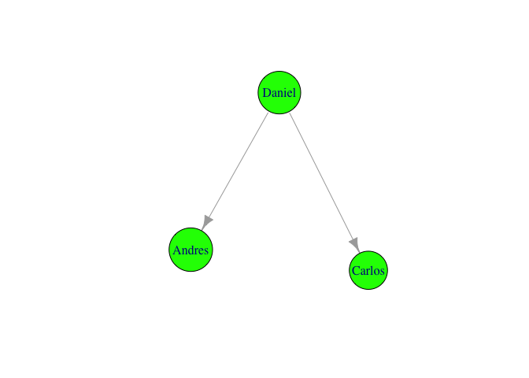
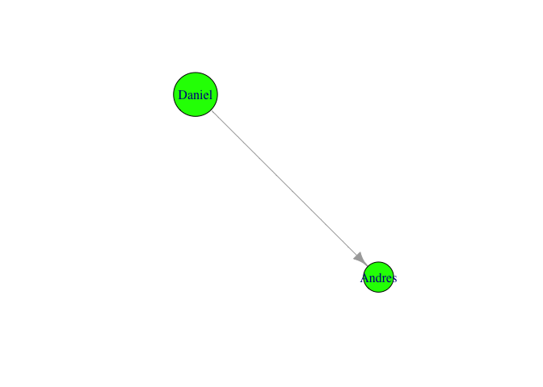
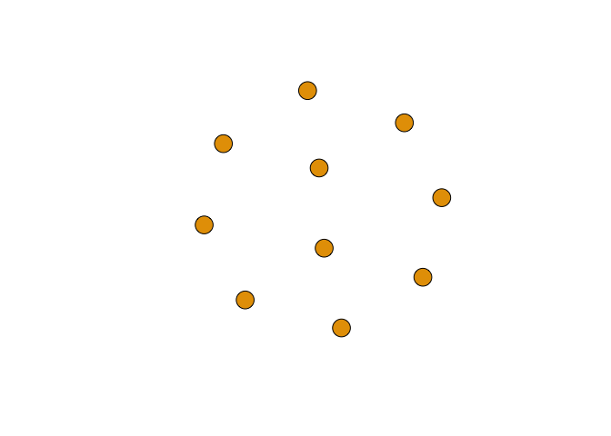
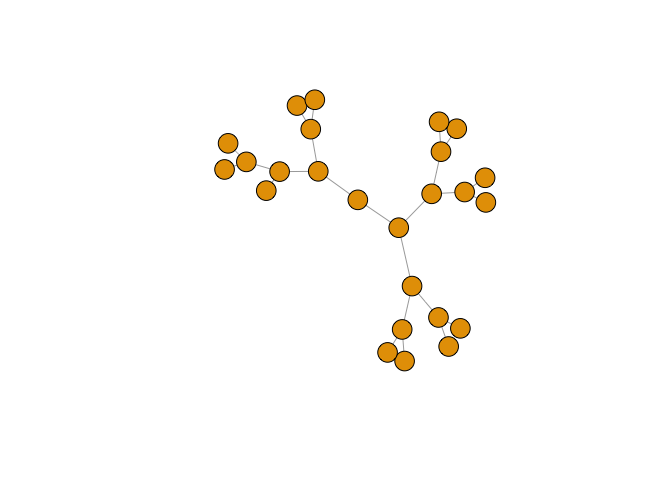
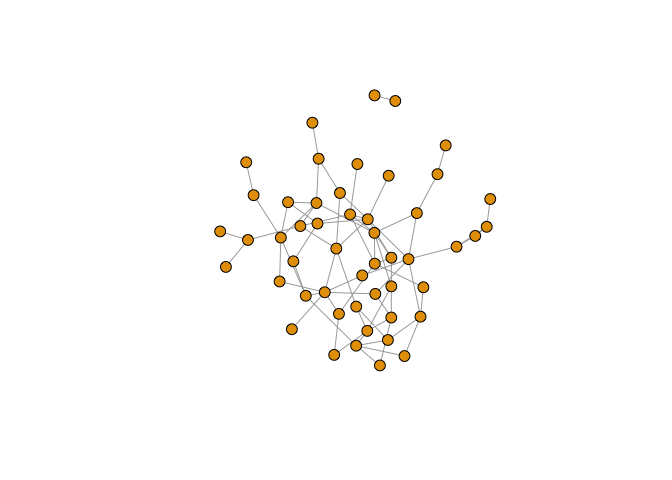
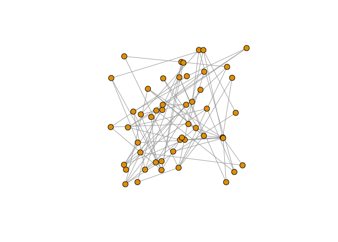
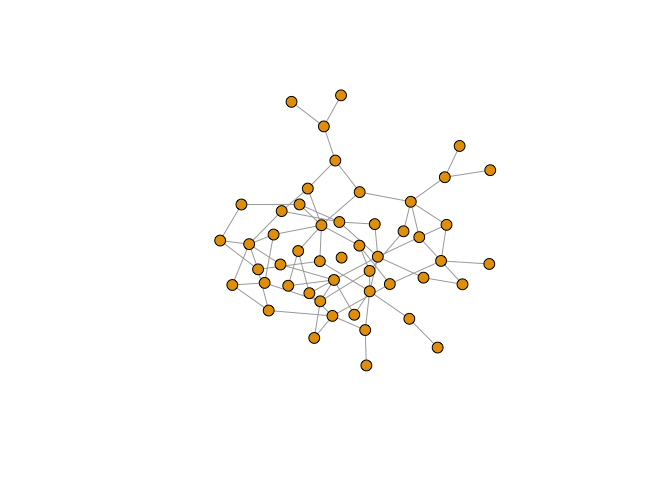
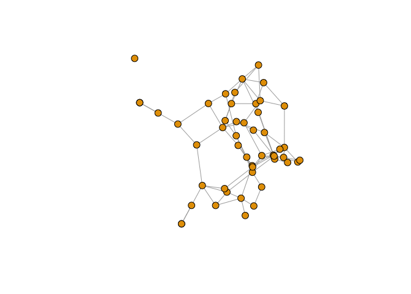

Antes de embarcarnos en el análisis de una red real veamos los
fundamentos del paquete `igraph` para `R`.

    library(igraph)

    ## Loading required package: methods

    ## 
    ## Attaching package: 'igraph'

    ## The following objects are masked from 'package:stats':
    ## 
    ##     decompose, spectrum

    ## The following object is masked from 'package:base':
    ## 
    ##     union

Hay múltiples modos de definir una red. En los siguientes scripts
veremos otras funciones, pero por ahora empezaremos definiendo la red
manualmente usando `graph_from_literal`. Como argumentos, pasaremos cada
uno de los vértices entre dos nodos. Para ello usaremos el signo `+`
para definir la cabeza de un vértice dirigido. Por ejemplo, podemos
definir una red muy sencilla tal y como sigue.

    g <- graph_from_literal(A--D, B--C, C--A, E--A, C--E, E--B)
    print(g)

    ## IGRAPH UN-- 5 6 -- 
    ## + attr: name (v/c)
    ## + edges (vertex names):
    ## [1] A--D A--C A--E B--C B--E C--E

y podemos dirigir algunas aristas:

    g <- graph_from_literal(A-+D, B++C, C+-A, E+-A, C-+E, E-+B)
    print(g)

    ## IGRAPH DN-- 5 7 -- 
    ## + attr: name (v/c)
    ## + edges (vertex names):
    ## [1] A->D A->C A->E B->C C->B C->E E->B

e incluso podemos utilizar etiquetas más descriptivas

    g <- graph_from_literal(Daniel-+Andres, 
                           Teresa++Carlos, 
                           Carlos+-Daniel, 
                           Elena+-Daniel, 
                           Carlos-+Elena, 
                           Elena-+Teresa)
    print(g)

    ## IGRAPH DN-- 5 7 -- 
    ## + attr: name (v/c)
    ## + edges (vertex names):
    ## [1] Daniel->Andres Daniel->Carlos Daniel->Elena  Teresa->Carlos
    ## [5] Carlos->Teresa Carlos->Elena  Elena ->Teresa

Aunque es posible utilizar `ggplot2` para visualizar redes, `igraph`
implementa métodos de visualización usando la librería básica. Veamos
por ejemplo el grafo de nuestra red

    plot(g)

Podemos adaptar los gráficos para adaptarnos a nuestros gustos:

    plot(g, edge.arrow.size=0.5, vertex.color="red", vertex.size=25, 
         vertex.label.color="black", vertex.label.dist=3, edge.curved=0.2)

y podemos también acceder a la matriz de adyacencias asociada a un
grafo:

    g[]

    ## 5 x 5 sparse Matrix of class "dgCMatrix"
    ##        Daniel Andres Teresa Carlos Elena
    ## Daniel      .      1      .      1     1
    ## Andres      .      .      .      .     .
    ## Teresa      .      .      .      1     .
    ## Carlos      .      .      1      .     1
    ## Elena       .      .      1      .     .

`igraph` ofrece formas sencillas de acceder a vértices y aristas con las
funciones `V` (vertex) y `E` (edge).

    V(g)

    ## + 5/5 vertices, named:
    ## [1] Daniel Andres Teresa Carlos Elena

    E(g)

    ## + 7/7 edges (vertex names):
    ## [1] Daniel->Andres Daniel->Carlos Daniel->Elena  Teresa->Carlos
    ## [5] Carlos->Teresa Carlos->Elena  Elena ->Teresa

Con estas funciones podemos acceder y asignar atributos. Los atributos
están almacenados como si fuesen parte de una lista.

    V(g)$name

    ## [1] "Daniel" "Andres" "Teresa" "Carlos" "Elena"

Pensemos por ejemplo que la red anterior es una red de amigos, que
pueden ser hombres o mujeres y que tienen edades entre 18 y 50 años.
Para simplificar las cosas usaremos números aleatorios de una
distribución uniforme.

    V(g)$genero <- c("hombre", "hombre", "mujer", "hombre", "mujer")
    V(g)$edad <- sample(18:50, 5)

Ahora podemos visualizar los atributos que acabamos de crear

    vertex_attr(g)

    ## $name
    ## [1] "Daniel" "Andres" "Teresa" "Carlos" "Elena" 
    ## 
    ## $genero
    ## [1] "hombre" "hombre" "mujer"  "hombre" "mujer" 
    ## 
    ## $edad
    ## [1] 48 33 31 45 49

    print(g)

    ## IGRAPH DN-- 5 7 -- 
    ## + attr: name (v/c), genero (v/c), edad (v/n)
    ## + edges (vertex names):
    ## [1] Daniel->Andres Daniel->Carlos Daniel->Elena  Teresa->Carlos
    ## [5] Carlos->Teresa Carlos->Elena  Elena ->Teresa

Del mismo modo, podemos crear atributos para los vértices. Supongamos,
por ejemplo, que conocemos para cada relación de amistad cómo se han
conocido, si a través de un equipo deportivo o en la universidad.

    E(g)$relationship <- sample(c("universidad", "equipo"), 7, TRUE)
    edge_attr(g)

    ## $relationship
    ## [1] "equipo"      "equipo"      "universidad" "equipo"      "equipo"     
    ## [6] "universidad" "universidad"

    print(g)

    ## IGRAPH DN-- 5 7 -- 
    ## + attr: name (v/c), genero (v/c), edad (v/n), relationship (e/c)
    ## + edges (vertex names):
    ## [1] Daniel->Andres Daniel->Carlos Daniel->Elena  Teresa->Carlos
    ## [5] Carlos->Teresa Carlos->Elena  Elena ->Teresa

Estos atributos pueden ser usados para crear grafos más informativos:

    V(g)$color <- c("brown", "green")[(V(g)$genero == "hombre") + 1]
    V(g)$size <- V(g)$edad
    plot(g, edge.arrow.size=0.5, vertex.color=V(g)$color, vertex.size=V(g)$size, 
         vertex.label.color="black", vertex.label.dist=2, edge.curved=0.2)

Ahora que sabemos cómo definir la red, veamos como extraer alguna
información que será útil para entenderla mejor. Por ejemplo, podemos
tomar la red y extraer subredes definidos por aristas, utilizando la
notación especial `%--%`.

    E(g)["Andres" %--% "Carlos"]

    ## + 0/7 edges (vertex names):

    E(g)["Andres" %->% "Carlos"]

    ## + 0/7 edges (vertex names):

    E(g)["Andres" %<-% "Carlos"]

    ## + 0/7 edges (vertex names):

Más interesante es recuperar subredes definidas por características de
los vértices. Por ejemplo, podemos extraer la subred formada únicamente
por hombres.

    hombres <- V(g)$genero == "hombre"
    sg <- induced_subgraph(g, hombres)
    print(sg)

    ## IGRAPH DN-- 3 2 -- 
    ## + attr: name (v/c), genero (v/c), edad (v/n), color (v/c), size
    ## | (v/n), relationship (e/c)
    ## + edges (vertex names):
    ## [1] Daniel->Andres Daniel->Carlos

    plot(sg)

Para hacer exploración es importante poder extraer la red `ego`, es
decir, la red relativa a un vértice. Esta red la podemos definir en
relación a un orden: mis amigos (orden 1), los amigos de mis amigos
(orden 2), los amigos de los amigos de mis amigos (orden 3).

    egoB <- ego(g, nodes=c("Andres"), order=1)
    print(egoB)

    ## [[1]]
    ## + 2/5 vertices, named:
    ## [1] Andres Daniel

Para poder visualizar esta red deberemos usar una función diferente:

    egoB <- make_ego_graph(g, nodes="Andres", order=1)[[1]]
    print(egoB)

    ## IGRAPH DN-- 2 1 -- 
    ## + attr: name (v/c), genero (v/c), edad (v/n), color (v/c), size
    ## | (v/n), relationship (e/c)
    ## + edge (vertex names):
    ## [1] Daniel->Andres

    plot(egoB)

Grafos especiales
-----------------

`igraph` ofrece la posibilidad de simular algunos tipos de grafos
especiales.

Grafo vacío:

    plot(make_empty_graph(10), vertex.label=NA)

Grafo completo

    plot(make_full_graph(10), vertex.label=NA)

Grafo en árbol

    plot(make_tree(25, mode='undirected'), vertex.label=NA)

Grafo de mundo pequeño (un grafo que conecta a los vecinos (`nei`) y con
probabilidad `p` conecta a dos nodos diferentes)

    g <- sample_smallworld(dim=2, size=10, nei=1, p=0.05)
    plot(g, layout=layout_in_circle, vertex.label=NA, vertex.size=5)

Grafo de Erdos-Renyi (un grafo de formación aleatoria con `n` nodos y
`m` aristas)

    plot(sample_gnm(n=50, m=75), vertex.label=NA)

Modificar la representación gráfica
-----------------------------------

Hemos visto en la parte teórica la relevancia de la forma en la que
presentamos el grafo. Aunque veremos herramientas para cuantificar los
grafos, la inspección visual es muy importante para entender qué ocurre
en nuestra base de datos. Aquí veremos algunos de los *layouts* más
conocidos.

    g <- sample_gnm(n=50, m=75)
    V(g)$label <- ""
    V(g)$size <- 8
    plot(g)

`igraph` tiene la posibilidad de usar uno de los algoritmos como un
parámetro más de la función o podemos pasar a la función la localización
de los nodos. Por ejemplo:

    plot(g, layout=layout_randomly)

o

    pos <- layout_in_circle(g)
    head(pos)

    ##       [,1]  [,2]
    ## [1,] 1.000 0.000
    ## [2,] 0.992 0.125
    ## [3,] 0.969 0.249
    ## [4,] 0.930 0.368
    ## [5,] 0.876 0.482
    ## [6,] 0.809 0.588

    plot(g, layout=pos)

Los dos modos de *layout* que más nos interesan son los que utilizan
para la disposición de los nodos bien un algoritmo o un modelo de
escalado.

Entre los algoritmos quizás el más conocido es el de
Fruchterman-Reingold que, como vimos, intenta optimizar la localización
de los nodos en función de varias condiciones. Puede costar mucho
esfuerzo computacional localizar todos los nodos en redes grandes.

    plot(g, layout=layout_with_fr)

Otra alternativa similar es el algoritmo de Kamada-Kawai, que suele
usarse como estimación iniciar para el cálculo de las localizaciones de
Fruchterman-Reingold ya que es mucho más rápido:

    plot(g, layout=layout_with_kk)

Como veíamos, una alternativa razonable es aprovechar métodos de
escalado como los que veremos en la próxima sesión que calcula la
disposición óptima en dos dimensiones:

    plot(g, layout=layout_with_mds)

