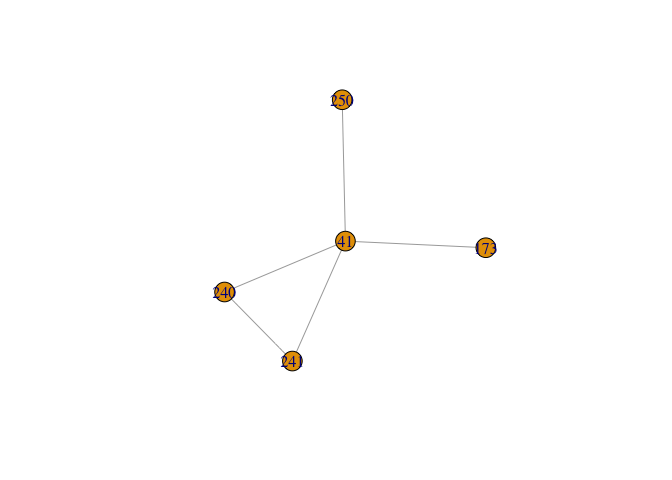
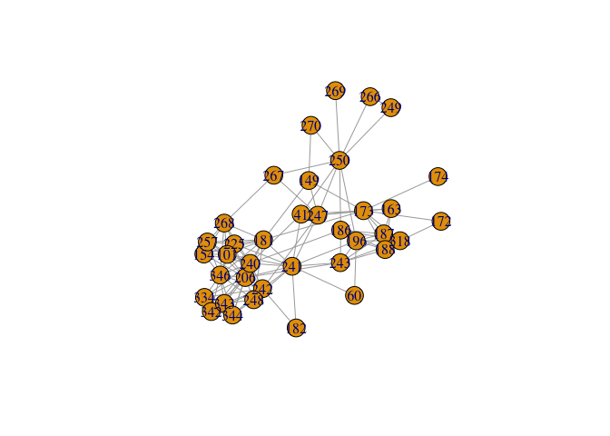
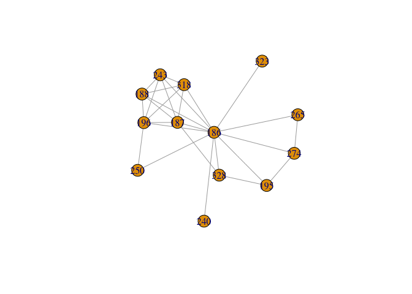
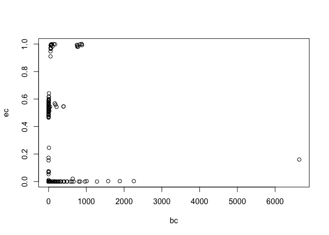
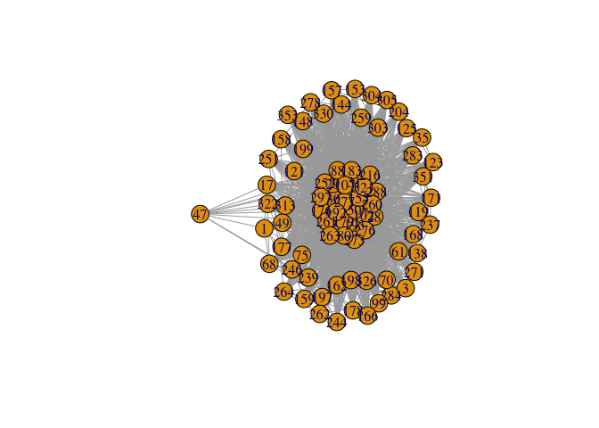
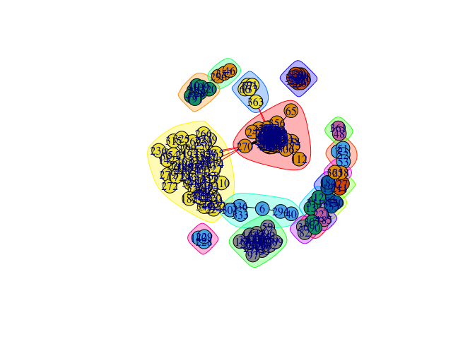

Empecemos por cargar de nuevo los datos

    library(igraph)

    ## Loading required package: methods

    ## 
    ## Attaching package: 'igraph'

    ## The following objects are masked from 'package:stats':
    ## 
    ##     decompose, spectrum

    ## The following object is masked from 'package:base':
    ## 
    ##     union

    edgelist <- readRDS("dta/edgelist-diputados.RDS")
    atributos <- readRDS("dta/atributos-diputados.RDS")

La lista de aristas que hemos creado antes se puede convertir en una red
en `igraph` utilizando la función `graph_from_edgelist`.

    g <- graph_from_edgelist(edgelist, directed=FALSE)
    print(g)

    ## IGRAPH UN-- 245 4715 -- 
    ## + attr: name (v/c)
    ## + edges (vertex names):
    ##  [1] 171--28  171--30  171--237 171--283 171--351 171--176 171--288
    ##  [8] 171--193 171--238 171--138 171--284 171--179 171--31  171--102
    ## [15] 171--50  171--260 171--29  171--252 171--88  171--261 171--277
    ## [22] 171--297 171--192 171--273 171--183 171--155 171--80  171--216
    ## [29] 171--107 171--321 171--276 171--263 7  --51  7  --52  320--26 
    ## [36] 187--173 187--186 187--328 187--188 187--219 187--345 187--279
    ## [43] 187--196 187--243 187--318 187--163 84 --130 84 --255 84 --255
    ## [50] 130--255 31 --276 276--121 276--162 276--326 276--303 192--276
    ## + ... omitted several edges

Exploremos ahora la red que acabamos de crear. Por ejemplo, podemos ver
la red del diputado `22`.

    plot(make_ego_graph(g, nodes="22", order=1)[[1]])

Lo que vemos es que nuestra red contiene muchas aristas redundantes.
Para cada iniciativa, hemos definido una arista de colaboración, pero lo
cierto es que lo que nos interesa es si dos diputados han colaborado
alguna vez. Por eso, deberíamos simplificar el conjunto de aristas que
tenemos en la red:

    g <- simplify(g)
    plot(make_ego_graph(g, nodes="22", order=1)[[1]])

Ahora que ya tenemos la red tal y como la queremos, empecemos a explorar
las redes *ego* de algunos diputados. Por ejemplo, podemos explorar la
red alrededor de `41`.

    ego41 <- make_ego_graph(g, nodes="41", order=1)[[1]]
    plot(ego41)

y ver la red de segundo orden

    ego41 <- make_ego_graph(g, nodes="41", order=2)[[1]] 
    plot(ego41)

Lo que vemos es que aunque tenga una red de primer orden con pocos
diputados, su red de segundo orden es muy amplia. El diputado `41` tiene
pocos *amigos*, pero sus *amigos* son muy populares. Podemos echar un
vistazo a otros diputados para ver si es un patron común. Por ejemplo,
el diputado `22` que ya hemos visto antes.

    ego(g, nodes="22", order=1)

    ## [[1]]
    ## + 7/245 vertices, named:
    ## [1] 22  26  43  108 191 104 109

    ego(g, nodes="22", order=2)

    ## [[1]]
    ## + 8/245 vertices, named:
    ## [1] 22  26  43  108 191 104 109 320

A diferencia de `41`, `22` tiene una red de segundo orden que es casi
igual a su red de primer orden. Sus *amigos* apenas tienen *amigos* que
no sean `22` mismo. La diferencia entre `41` y `22` es crucial y nos
habla de dos tipos diferentes de relaciones. `22` pertenece a una
*comunidad* casi cerrada, mientras que `41` parece un elemento de gran
importancia dentro de las conexiones de la red.

Veamos ahora cómo capturar este tipo de información de manera más
general. Podemos, por ejemplo, empezar con un modo de contar el número
de conexiones que tiene cada individuo en la red.

    degdip <- degree(g)

y podemos ver que ese número coincide con el número de vértices que
podemos recuperar a través de la red *ego* de un individuo determinado:

    degdip[names(degdip) == "22"]

    ## 22 
    ##  6

    ego(g, nodes="22", order=1)

    ## [[1]]
    ## + 7/245 vertices, named:
    ## [1] 22  26  43  108 191 104 109

Y podemos tambien ver cómo se distribuye esta variable a lo largo de la
red.

    hist(degdip)

 Lo que apreciamos es que existe un
grupo de usuarios muy densamente conectados y una mayoría que tiene un
número de conexiones mucho menor.

Este concepto de "conectividad" lo podemos capturar un poco mejor a
través de la *transitividad* de cada nodo.

    trdip <- transitivity(g, "local")

Veamos los datos aplicados a nuestro ejemplo de antes

    trdip[names(degdip) == "22"] ## Alta densidad 

    ## [1] 0.733

    plot(make_ego_graph(g, nodes="22", order=2)[[1]])

Lo que podemos apreciar es que la red alrededor de `22` está muy
densamente conectada: los *amigos* de los *amigos* de `22` casi siempre
amigos de `22`.

Podemos contrastar esta situación con el diputado `186`.

    trdip[names(degdip) == "186"]

    ## [1] 0.227

    plot(make_ego_graph(g, nodes="186", order=1)[[1]]) ## Densa en primer grado

    plot(make_ego_graph(g, nodes="186", order=2)[[1]]) ## No densa en segundo

En este caso, vemos que su red de primer orden también es muy densa,
pero sin embargo es poco probable que el *amigo* de un *amigo* de `186`
sea amigo de `186`.

¿Qué tipo de relación es más frecuente en la red? Para eso podemos pedir
la transitividad *global* de la red

    transitivity(g, "global")

    ## [1] 0.66

Otra medida interesante es la distancia media entre dos nodos
cualesquiera.

    mean_distance(g)

    ## [1] 3.58

Pero ya hemos visto que esta información puede ser poco informativa si
existen grandes desigualdades en las conexiones de diferentes nodos, tal
y como es el caso. Por eso quizás sea más útil ver la tabla completa de
distancias. La tabla nos da el número de pares que están a una
determinada distancia.

    distance_table(g)

    ## $res
    ##  [1] 2364 2908 1687 2502 2217 1492  455  253  106   87    9    4
    ## 
    ## $unconnected
    ## [1] 15806

El máximo de ese vector es el *diámetro* de la red.

    diameter(g)

    ## [1] 12

Otra forma de atacar el problema es midiendo la distancia más corta
entre dos vértices.

    shortest_paths(g, "187", "171")

    ## $vpath
    ## $vpath[[1]]
    ## + 6/245 vertices, named:
    ## [1] 187 173 149 270 50  171
    ## 
    ## 
    ## $epath
    ## NULL
    ## 
    ## $predecessors
    ## NULL
    ## 
    ## $inbound_edges
    ## NULL

aunque por supuesto esta es una tarea que no querríamos hacer para cada
par de nodos.

En su lugar, podemos mirar a las medidas de centralidad. Las tres
medidas más frecuentes son la *intermediación* y la distancia en
*autovector*, muy próxima a al *Page rank*. Es importante importante
recordar que estas medidas capturan diferentes nociones de centralidad,
tal y como hemos visto antes.

    bc <- betweenness(g)
    head(bc)

    ##      171       28       30      237      283      351 
    ##  20.6952 103.3703 173.0570 184.8421  19.5759   0.0431

    ec <- eigen_centrality(g)$vector
    head(ec)

    ##   171    28    30   237   283   351 
    ## 0.536 0.984 0.998 0.559 0.515 0.514

    pg <- page_rank(g)$vector
    head(pg)

    ##     171      28      30     237     283     351 
    ## 0.00332 0.00721 0.00760 0.00408 0.00314 0.00296

Pero podemos verlo de forma más práctica si miramos a la centralidad de
los dos diputados que hemos estudiado antes

    bc[names(bc) == "22"]

    ##   22 
    ## 1.33

    bc[names(bc) == "186"]

    ## 186 
    ## 835

Esto nos viene a confirmar que, quizás precisamente porque la red de
`22` está muy conectada entre ella, la centralidad de `22` es en
realidad muy baja. Por el contrario, `186` tiene una enorme centralidad
precisamente porque su red se exiende muy rápido, a pesar de que tiene
pocos *amigos*.

Sin embargo, las dos medidas están muy poco relacionadas:

    plot(bc, ec) ## WAT!

¿Cómo es eso posible? Investiguemos un caso en el que las dos medidas
nos dan diferentes interpretaciones:

    names(bc[bc < 100 & ec > .8])

    ##  [1] "176" "288" "193" "179" "31"  "102" "260" "192" "273" "183" "80" 
    ## [12] "216" "107" "321" "263"

    plot(make_ego_graph(g, nodes="176", order=1)[[1]])

y veamos cómo es su red *ego*:

    ego(g, nodes="176", order=1)

    ## [[1]]
    ## + 79/245 vertices, named:
    ##  [1] 176 171 28  30  237 283 351 288 193 138 284 179 31  102 50  260 29 
    ## [18] 252 88  261 277 297 192 273 183 155 80  216 107 321 276 263 121 162
    ## [35] 326 303 1   3   123 35  204 159 251 239 153 198 157 168 75  125 17 
    ## [52] 148 49  158 61  313 68  246 70  178 99  271 259 166 322 177 197 353
    ## [69] 262 264 278 199 330 144 119 244 304 305 47

    ego(g, nodes="176", order=2)

    ## [[1]]
    ## + 89/245 vertices, named:
    ##  [1] 176 171 28  30  237 283 351 288 193 138 284 179 31  102 50  260 29 
    ## [18] 252 88  261 277 297 192 273 183 155 80  216 107 321 276 263 121 162
    ## [35] 326 303 1   3   123 35  204 159 251 239 153 198 157 168 75  125 17 
    ## [52] 148 49  158 61  313 68  246 70  178 99  271 259 166 322 177 197 353
    ## [69] 262 264 278 199 330 144 119 244 304 305 47  238 175 194 112 356 65 
    ## [86] 270 24  306 363

    ego(g, nodes="176", order=3)

    ## [[1]]
    ## + 97/245 vertices, named:
    ##  [1] 176 171 28  30  237 283 351 288 193 138 284 179 31  102 50  260 29 
    ## [18] 252 88  261 277 297 192 273 183 155 80  216 107 321 276 263 121 162
    ## [35] 326 303 1   3   123 35  204 159 251 239 153 198 157 168 75  125 17 
    ## [52] 148 49  158 61  313 68  246 70  178 99  271 259 166 322 177 197 353
    ## [69] 262 264 278 199 330 144 119 244 304 305 47  238 175 194 112 356 65 
    ## [86] 270 24  306 363 149 250 274 265 67  66  91  137

¿Cómo interpretamos esto?

Detección de comunidades
------------------------

Una forma de aproximarnos a la paradoja anterior es a través de la
noción de comunidades. `igraph` ofrece varias formas de calcular las
comunidades que existen en nuestro grafo. Como hemos visto, existen
varias alternativas para aproximarnos a este concepto. Una de ellas, el
método de Newman-Girvan, elimina enlaces según su grado de centralidad
de intermediación.

    cl_ng <- cluster_edge_betweenness(g)
    cl_ng

    ## IGRAPH clustering edge betweenness, groups: 19, mod: 0.36
    ## + groups:
    ##   $`1`
    ##    [1] "171" "28"  "30"  "237" "283" "351" "176" "288" "193" "238" "138"
    ##   [12] "284" "179" "31"  "102" "50"  "260" "29"  "252" "88"  "261" "277"
    ##   [23] "297" "192" "273" "183" "155" "80"  "216" "107" "321" "276" "263"
    ##   [34] "121" "162" "326" "303" "1"   "3"   "123" "35"  "204" "159" "251"
    ##   [45] "239" "153" "198" "157" "168" "75"  "125" "17"  "148" "49"  "158"
    ##   [56] "61"  "313" "68"  "246" "70"  "178" "99"  "271" "259" "166" "322"
    ##   [67] "177" "197" "353" "262" "264" "278" "199" "330" "144" "119" "244"
    ##   [78] "304" "305" "356" "175" "194" "47"  "112" "270" "24"  "306" "65" 
    ##   
    ##   + ... omitted several groups/vertices

Podemos visualizar las comunidades de forma muy sencilla

    plot(cl_ng, g)

Otra alternativa muy popular usa el método de Lovaina.

    cl_lov <- cluster_louvain(g)
    cl_lov

    ## IGRAPH clustering multi level, groups: 18, mod: 0.36
    ## + groups:
    ##   $`1`
    ##   [1] "7"  "51" "52" "53"
    ##   
    ##   $`2`
    ##   [1] "84"  "130" "255"
    ##   
    ##   $`3`
    ##    [1] "171" "28"  "30"  "237" "283" "351" "176" "288" "193" "238" "138"
    ##   [12] "284" "179" "31"  "102" "50"  "260" "29"  "252" "88"  "261" "277"
    ##   [23] "297" "192" "273" "183" "155" "80"  "216" "107" "321" "276" "263"
    ##   + ... omitted several groups/vertices

    member <- membership(cl_lov)
    head(member)

    ## 171  28  30 237 283 351 
    ##   3   3   3   3   3   3

Podemos echar un vistazo a la distribución de los miembros de cada una
de las comunidades que hemos estimado

    table(member)

    ## member
    ##  1  2  3  4  5  6  7  8  9 10 11 12 13 14 15 16 17 18 
    ##  4  3 87  2  8  2 30  3  3  5  2 73 12  2  2  2  3  2

y podemos comparar los resultados de uno y otro método

    table(member, membership(cl_ng))

    ##       
    ## member  1  2  3  4  5  6  7  8  9 10 11 12 13 14 15 16 17 18 19
    ##     1   0  4  0  0  0  0  0  0  0  0  0  0  0  0  0  0  0  0  0
    ##     2   0  0  0  0  3  0  0  0  0  0  0  0  0  0  0  0  0  0  0
    ##     3  87  0  0  0  0  0  0  0  0  0  0  0  0  0  0  0  0  0  0
    ##     4   0  0  0  0  0  2  0  0  0  0  0  0  0  0  0  0  0  0  0
    ##     5   0  0  8  0  0  0  0  0  0  0  0  0  0  0  0  0  0  0  0
    ##     6   0  0  0  0  0  0  2  0  0  0  0  0  0  0  0  0  0  0  0
    ##     7   0  0  0  0  0  0  0 30  0  0  0  0  0  0  0  0  0  0  0
    ##     8   0  0  0  0  0  0  0  0  3  0  0  0  0  0  0  0  0  0  0
    ##     9   0  0  0  0  0  0  0  0  0  0  3  0  0  0  0  0  0  0  0
    ##     10  0  0  0  0  0  0  0  0  0  0  0  5  0  0  0  0  0  0  0
    ##     11  0  0  0  0  0  0  0  0  0  0  0  0  2  0  0  0  0  0  0
    ##     12  1  0  0 66  0  0  0  0  0  6  0  0  0  0  0  0  0  0  0
    ##     13  0  0  0  0  0  0  0  0  0  0  0  0  0 12  0  0  0  0  0
    ##     14  0  0  0  0  0  0  0  0  0  0  0  0  0  0  2  0  0  0  0
    ##     15  0  0  0  0  0  0  0  0  0  0  0  0  0  0  0  2  0  0  0
    ##     16  0  0  0  0  0  0  0  0  0  0  0  0  0  0  0  0  2  0  0
    ##     17  0  0  0  0  0  0  0  0  0  0  0  0  0  0  0  0  0  3  0
    ##     18  0  0  0  0  0  0  0  0  0  0  0  0  0  0  0  0  0  0  2

Aunque haya algunas diferencias, mantienen una enorme similitud entre
los dos.

Pero miremos a ver si entendemos cuál es la lógica de estas comunidades.
Para eso echaremos mano de la base de datos de atributos que creamos
antes.

    louvain <- data.frame("comunidad"=as.vector(member),
                          "id"=attr(member, "names"))
    comunidad <- merge(atributos, louvain)

Ahora, veamos qué ocurre si tabulamos cada una de las comunidades con el
partido al que pertenece cada uno de los miembros:

    sapply(split(comunidad, list(comunidad$comunidad)), function(x) table(x$grupo))

    ##                                                     1 2  3 4 5 6  7 8 9 10
    ## Socialista                                          0 0 84 0 0 0  0 0 0  0
    ## Popular                                             4 3  2 0 8 2  0 3 3  5
    ## Vasco                                               0 0  0 0 0 0  0 0 0  0
    ## Confederal de Unidos Podemos-En Comú Podem-En Marea 0 0  0 0 0 0  0 0 0  0
    ## Mixto                                               0 0  0 2 0 0  0 0 0  0
    ## Ciudadanos                                          0 0  0 0 0 0 29 0 0  0
    ## Esquerra Republicana                                0 0  0 0 0 0  0 0 0  0
    ##                                                     11 12 13 14 15 16 17
    ## Socialista                                           0  0  0  0  0  0  0
    ## Popular                                              2  0 12  0  2  2  3
    ## Vasco                                                0  0  0  0  0  0  0
    ## Confederal de Unidos Podemos-En Comú Podem-En Marea  0 59  0  2  0  0  0
    ## Mixto                                                0  9  0  0  0  0  0
    ## Ciudadanos                                           0  0  0  0  0  0  0
    ## Esquerra Republicana                                 0  5  0  0  0  0  0
    ##                                                     18
    ## Socialista                                           0
    ## Popular                                              2
    ## Vasco                                                0
    ## Confederal de Unidos Podemos-En Comú Podem-En Marea  0
    ## Mixto                                                0
    ## Ciudadanos                                           0
    ## Esquerra Republicana                                 0

Los resultados que hemos visto hasta ahora deberían tener mucho más
sentido.
