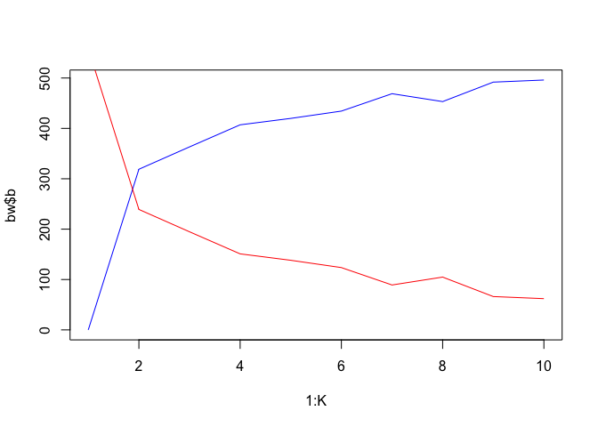

Intentemos capturar ahora datos relacionados con Seguridad y Defensa
para cada municipio en Colombia. Como vamos a obtener datos de
*endpoints* de diferentes bases de datos, lo que haremos será usar un
pequeño archivo de texto que contiene las URL de las que queremos
extraer información. Tmabién crearemos una pequeña base de datos que nos
sirva de referencia.

    library(readr)
    library(httr)
    library(jsonlite)

    ## Loading required package: methods

    library(plyr); library(dplyr)

    ## 
    ## Attaching package: 'dplyr'

    ## The following objects are masked from 'package:plyr':
    ## 
    ##     arrange, count, desc, failwith, id, mutate, rename, summarise,
    ##     summarize

    ## The following objects are masked from 'package:stats':
    ## 
    ##     filter, lag

    ## The following objects are masked from 'package:base':
    ## 
    ##     intersect, setdiff, setequal, union

    rl <- readLines("endpoints.txt")
    dbase <- gsub(".*Seguridad-y-Defensa/(.*)-2017/(.*)", "\\1", rl)
    endpoint <- gsub(".*Seguridad-y-Defensa/(.*)-2017/(.*)", "\\2", rl)

    endpoints <- data.frame("endpoint"=endpoint, "database"=dbase)
    head(endpoints)

    ##    endpoint                 database
    ## 1 c2ep-i3tw  Violencia-Intrafamiliar
    ## 2 ab9a-iat7               Terrorismo
    ## 3 3shj-83kw                Secuestro
    ## 4 ti8x-jb4d Pirater%C3%ADa-Terrestre
    ## 5 w8hi-kp4b      Lesiones-Personales
    ## 6 8p3w-yr5h    Hurto-de-Motocicletas

Ahora recogeremos los datos de cada uno de esos *endpoints*. Para ello
usaremos un par de funciones que nos ayudarán en el proceso.

    creds <- readLines("./credentials-datos-abiertos.txt")
    baseurl <- "https://www.datos.gov.co/resource/%s.json"

    pasar_pagina <- function(i, block=1000) {
        return(list("$limit"=block,
                    "$offset"=block*(i - 1))) 
    }

    collect_data <- function(url, maxpag=10) {
        status <- TRUE
        i <- 1
        res <- list()
        while (status) {
            print(sprintf("Recogiendo datos de pagina %s", i))
            r <- GET(url,
                     query=pasar_pagina(i),
                     add_headers("X-App-Token"=creds))
            status <- status_code(r) == 200
            if (status) {
                print("...Guardando datos")
                if (length(content(r)) > 0) {
                    res[[i]] <- fromJSON(content(r, "text"))
                } else {
                    print("I'm stopping now!")
                    status <- FALSE
                }
            }
            if (i >= maxpag | !status) { ## Para no eternizarnos
                status <- FALSE
            }
            ## Sys.sleep(2)
            i <- i + 1
        }
        return(do.call(rbind.fill, res))
    }

Lo que haremos será llamar cada uno de esos *endpoints*, recoger hasta 5
páginas de información y agrupar la información por departamento y
municipio en diferentes elementos de una lista:

    out <- list()
    for (i in 1:nrow(endpoints)) {
        URL <- sprintf(baseurl, endpoints$endpoint[i])
        out[[i]] <- as.data.frame(collect_data(URL, 5))
        out[[i]] <- out[[i]] %>%
            group_by(departamento, municipio) %>%
            summarize(n=n())
        out[[i]]$var <- endpoints$database[i]
    }

    ## [1] "Recogiendo datos de pagina 1"
    ## [1] "...Guardando datos"
    ## [1] "Recogiendo datos de pagina 2"
    ## [1] "...Guardando datos"
    ## [1] "Recogiendo datos de pagina 3"
    ## [1] "...Guardando datos"
    ## [1] "Recogiendo datos de pagina 4"
    ## [1] "...Guardando datos"
    ## [1] "Recogiendo datos de pagina 5"
    ## [1] "...Guardando datos"
    ## [1] "Recogiendo datos de pagina 1"
    ## [1] "...Guardando datos"
    ## [1] "Recogiendo datos de pagina 2"
    ## [1] "...Guardando datos"
    ## [1] "I'm stopping now!"
    ## [1] "Recogiendo datos de pagina 1"
    ## [1] "...Guardando datos"
    ## [1] "Recogiendo datos de pagina 2"
    ## [1] "...Guardando datos"
    ## [1] "I'm stopping now!"
    ## [1] "Recogiendo datos de pagina 1"
    ## [1] "...Guardando datos"
    ## [1] "Recogiendo datos de pagina 2"
    ## [1] "...Guardando datos"
    ## [1] "I'm stopping now!"
    ## [1] "Recogiendo datos de pagina 1"
    ## [1] "...Guardando datos"
    ## [1] "Recogiendo datos de pagina 2"
    ## [1] "...Guardando datos"
    ## [1] "Recogiendo datos de pagina 3"
    ## [1] "...Guardando datos"
    ## [1] "Recogiendo datos de pagina 4"
    ## [1] "...Guardando datos"
    ## [1] "Recogiendo datos de pagina 5"
    ## [1] "...Guardando datos"
    ## [1] "Recogiendo datos de pagina 1"
    ## [1] "...Guardando datos"
    ## [1] "Recogiendo datos de pagina 2"
    ## [1] "...Guardando datos"
    ## [1] "Recogiendo datos de pagina 3"
    ## [1] "...Guardando datos"
    ## [1] "Recogiendo datos de pagina 4"
    ## [1] "...Guardando datos"
    ## [1] "Recogiendo datos de pagina 5"
    ## [1] "...Guardando datos"
    ## [1] "Recogiendo datos de pagina 1"
    ## [1] "...Guardando datos"
    ## [1] "Recogiendo datos de pagina 2"
    ## [1] "...Guardando datos"
    ## [1] "Recogiendo datos de pagina 3"
    ## [1] "...Guardando datos"
    ## [1] "Recogiendo datos de pagina 4"
    ## [1] "...Guardando datos"
    ## [1] "Recogiendo datos de pagina 5"
    ## [1] "...Guardando datos"
    ## [1] "Recogiendo datos de pagina 1"
    ## [1] "...Guardando datos"
    ## [1] "Recogiendo datos de pagina 2"
    ## [1] "...Guardando datos"
    ## [1] "Recogiendo datos de pagina 3"
    ## [1] "...Guardando datos"
    ## [1] "Recogiendo datos de pagina 4"
    ## [1] "...Guardando datos"
    ## [1] "Recogiendo datos de pagina 5"
    ## [1] "...Guardando datos"
    ## [1] "Recogiendo datos de pagina 1"
    ## [1] "...Guardando datos"
    ## [1] "Recogiendo datos de pagina 2"
    ## [1] "...Guardando datos"
    ## [1] "Recogiendo datos de pagina 3"
    ## [1] "...Guardando datos"
    ## [1] "Recogiendo datos de pagina 4"
    ## [1] "...Guardando datos"
    ## [1] "Recogiendo datos de pagina 5"
    ## [1] "...Guardando datos"
    ## [1] "Recogiendo datos de pagina 1"
    ## [1] "...Guardando datos"
    ## [1] "Recogiendo datos de pagina 2"
    ## [1] "...Guardando datos"
    ## [1] "Recogiendo datos de pagina 3"
    ## [1] "...Guardando datos"
    ## [1] "Recogiendo datos de pagina 4"
    ## [1] "...Guardando datos"
    ## [1] "I'm stopping now!"
    ## [1] "Recogiendo datos de pagina 1"
    ## [1] "...Guardando datos"
    ## [1] "Recogiendo datos de pagina 2"
    ## [1] "...Guardando datos"
    ## [1] "Recogiendo datos de pagina 3"
    ## [1] "...Guardando datos"
    ## [1] "Recogiendo datos de pagina 4"
    ## [1] "...Guardando datos"
    ## [1] "Recogiendo datos de pagina 5"
    ## [1] "...Guardando datos"
    ## [1] "Recogiendo datos de pagina 1"
    ## [1] "...Guardando datos"
    ## [1] "Recogiendo datos de pagina 2"
    ## [1] "...Guardando datos"
    ## [1] "I'm stopping now!"
    ## [1] "Recogiendo datos de pagina 1"
    ## [1] "...Guardando datos"
    ## [1] "Recogiendo datos de pagina 2"
    ## [1] "...Guardando datos"
    ## [1] "Recogiendo datos de pagina 3"
    ## [1] "...Guardando datos"
    ## [1] "Recogiendo datos de pagina 4"
    ## [1] "...Guardando datos"
    ## [1] "Recogiendo datos de pagina 5"
    ## [1] "...Guardando datos"
    ## [1] "I'm stopping now!"
    ## [1] "Recogiendo datos de pagina 1"
    ## [1] "...Guardando datos"
    ## [1] "Recogiendo datos de pagina 2"
    ## [1] "...Guardando datos"
    ## [1] "Recogiendo datos de pagina 3"
    ## [1] "...Guardando datos"
    ## [1] "I'm stopping now!"
    ## [1] "Recogiendo datos de pagina 1"
    ## [1] "...Guardando datos"
    ## [1] "Recogiendo datos de pagina 2"
    ## [1] "...Guardando datos"
    ## [1] "Recogiendo datos de pagina 3"
    ## [1] "...Guardando datos"
    ## [1] "Recogiendo datos de pagina 4"
    ## [1] "...Guardando datos"
    ## [1] "Recogiendo datos de pagina 5"
    ## [1] "...Guardando datos"
    ## [1] "Recogiendo datos de pagina 1"
    ## [1] "...Guardando datos"
    ## [1] "Recogiendo datos de pagina 2"
    ## [1] "...Guardando datos"
    ## [1] "Recogiendo datos de pagina 3"
    ## [1] "...Guardando datos"
    ## [1] "Recogiendo datos de pagina 4"
    ## [1] "...Guardando datos"
    ## [1] "Recogiendo datos de pagina 5"
    ## [1] "...Guardando datos"
    ## [1] "Recogiendo datos de pagina 1"
    ## [1] "...Guardando datos"
    ## [1] "Recogiendo datos de pagina 2"
    ## [1] "...Guardando datos"
    ## [1] "I'm stopping now!"
    ## [1] "Recogiendo datos de pagina 1"
    ## [1] "...Guardando datos"
    ## [1] "Recogiendo datos de pagina 2"
    ## [1] "...Guardando datos"
    ## [1] "I'm stopping now!"

    str(out)

    ## List of 18
    ##  $ :Classes 'grouped_df', 'tbl_df', 'tbl' and 'data.frame':  561 obs. of  4 variables:
    ##   ..$ departamento: chr [1:561] "AMAZONAS" "ANTIOQUIA" "ANTIOQUIA" "ANTIOQUIA" ...
    ##   ..$ municipio   : chr [1:561] "LETICIA (CT)" "ABEJORRAL" "AMAGÁ" "ANDES" ...
    ##   ..$ n           : int [1:561] 8 1 3 8 5 1 16 1 3 8 ...
    ##   ..$ var         : Factor w/ 18 levels "Abigeato","Acciones-Subversivas",..: 18 18 18 18 18 18 18 18 18 18 ...
    ##   ..- attr(*, "vars")= chr "departamento"
    ##   ..- attr(*, "drop")= logi TRUE
    ##  $ :Classes 'grouped_df', 'tbl_df', 'tbl' and 'data.frame':  10 obs. of  4 variables:
    ##   ..$ departamento: chr [1:10] "ANTIOQUIA" "ARAUCA" "ARAUCA" "CESAR" ...
    ##   ..$ municipio   : chr [1:10] "SEGOVIA" "ARAUQUITA" "FORTUL" "LA GLORIA" ...
    ##   ..$ n           : int [1:10] 1 3 1 2 1 4 1 1 3 1
    ##   ..$ var         : Factor w/ 18 levels "Abigeato","Acciones-Subversivas",..: 17 17 17 17 17 17 17 17 17 17
    ##   ..- attr(*, "vars")= chr "departamento"
    ##   ..- attr(*, "drop")= logi TRUE
    ##  $ :Classes 'grouped_df', 'tbl_df', 'tbl' and 'data.frame':  38 obs. of  4 variables:
    ##   ..$ departamento: chr [1:38] "ANTIOQUIA" "ANTIOQUIA" "ARAUCA" "ARAUCA" ...
    ##   ..$ municipio   : chr [1:38] "BELLO" "MEDELLÍN (CT)" "ARAUCA (CT)" "ARAUQUITA" ...
    ##   ..$ n           : int [1:38] 2 1 1 4 1 1 1 1 1 2 ...
    ##   ..$ var         : Factor w/ 18 levels "Abigeato","Acciones-Subversivas",..: 16 16 16 16 16 16 16 16 16 16 ...
    ##   ..- attr(*, "vars")= chr "departamento"
    ##   ..- attr(*, "drop")= logi TRUE
    ##  $ :Classes 'grouped_df', 'tbl_df', 'tbl' and 'data.frame':  41 obs. of  4 variables:
    ##   ..$ departamento: chr [1:41] "ANTIOQUIA" "ANTIOQUIA" "ANTIOQUIA" "ANTIOQUIA" ...
    ##   ..$ municipio   : chr [1:41] "BARBOSA" "CALDAS" "CAUCASIA" "COCORNÁ" ...
    ##   ..$ n           : int [1:41] 4 2 1 1 1 1 1 1 2 2 ...
    ##   ..$ var         : Factor w/ 18 levels "Abigeato","Acciones-Subversivas",..: 15 15 15 15 15 15 15 15 15 15 ...
    ##   ..- attr(*, "vars")= chr "departamento"
    ##   ..- attr(*, "drop")= logi TRUE
    ##  $ :Classes 'grouped_df', 'tbl_df', 'tbl' and 'data.frame':  640 obs. of  4 variables:
    ##   ..$ departamento: chr [1:640] "AMAZONAS" "ANTIOQUIA" "ANTIOQUIA" "ANTIOQUIA" ...
    ##   ..$ municipio   : chr [1:640] "LETICIA (CT)" "ABEJORRAL" "AMAGÁ" "AMALFI" ...
    ##   ..$ n           : int [1:640] 15 8 4 2 3 1 1 1 17 1 ...
    ##   ..$ var         : Factor w/ 18 levels "Abigeato","Acciones-Subversivas",..: 14 14 14 14 14 14 14 14 14 14 ...
    ##   ..- attr(*, "vars")= chr "departamento"
    ##   ..- attr(*, "drop")= logi TRUE
    ##  $ :Classes 'grouped_df', 'tbl_df', 'tbl' and 'data.frame':  399 obs. of  4 variables:
    ##   ..$ departamento: chr [1:399] "AMAZONAS" "ANTIOQUIA" "ANTIOQUIA" "ANTIOQUIA" ...
    ##   ..$ municipio   : chr [1:399] "LETICIA (CT)" "ABEJORRAL" "ALEJANDRÍA" "AMAGÁ" ...
    ##   ..$ n           : int [1:399] 4 2 1 1 1 4 8 3 115 2 ...
    ##   ..$ var         : Factor w/ 18 levels "Abigeato","Acciones-Subversivas",..: 11 11 11 11 11 11 11 11 11 11 ...
    ##   ..- attr(*, "vars")= chr "departamento"
    ##   ..- attr(*, "drop")= logi TRUE
    ##  $ :Classes 'grouped_df', 'tbl_df', 'tbl' and 'data.frame':  511 obs. of  4 variables:
    ##   ..$ departamento: chr [1:511] "AMAZONAS" "ANTIOQUIA" "ANTIOQUIA" "ANTIOQUIA" ...
    ##   ..$ municipio   : chr [1:511] "LETICIA (CT)" "ABEJORRAL" "AMAGÁ" "AMALFI" ...
    ##   ..$ n           : int [1:511] 17 6 3 1 4 2 2 5 1 9 ...
    ##   ..$ var         : Factor w/ 18 levels "Abigeato","Acciones-Subversivas",..: 13 13 13 13 13 13 13 13 13 13 ...
    ##   ..- attr(*, "vars")= chr "departamento"
    ##   ..- attr(*, "drop")= logi TRUE
    ##  $ :Classes 'grouped_df', 'tbl_df', 'tbl' and 'data.frame':  373 obs. of  4 variables:
    ##   ..$ departamento: chr [1:373] "AMAZONAS" "ANTIOQUIA" "ANTIOQUIA" "ANTIOQUIA" ...
    ##   ..$ municipio   : chr [1:373] "LETICIA (CT)" "ABEJORRAL" "AMAGÁ" "ANDES" ...
    ##   ..$ n           : int [1:373] 4 3 1 1 1 14 1 5 39 7 ...
    ##   ..$ var         : Factor w/ 18 levels "Abigeato","Acciones-Subversivas",..: 12 12 12 12 12 12 12 12 12 12 ...
    ##   ..- attr(*, "vars")= chr "departamento"
    ##   ..- attr(*, "drop")= logi TRUE
    ##  $ :Classes 'grouped_df', 'tbl_df', 'tbl' and 'data.frame':  305 obs. of  4 variables:
    ##   ..$ departamento: chr [1:305] "AMAZONAS" "ANTIOQUIA" "ANTIOQUIA" "ANTIOQUIA" ...
    ##   ..$ municipio   : chr [1:305] "LETICIA (CT)" "ABEJORRAL" "ANDES" "ANORÍ" ...
    ##   ..$ n           : int [1:305] 6 2 1 1 4 1 2 56 6 1 ...
    ##   ..$ var         : Factor w/ 18 levels "Abigeato","Acciones-Subversivas",..: 10 10 10 10 10 10 10 10 10 10 ...
    ##   ..- attr(*, "vars")= chr "departamento"
    ##   ..- attr(*, "drop")= logi TRUE
    ##  $ :Classes 'grouped_df', 'tbl_df', 'tbl' and 'data.frame':  184 obs. of  4 variables:
    ##   ..$ departamento: chr [1:184] "ANTIOQUIA" "ANTIOQUIA" "ANTIOQUIA" "ANTIOQUIA" ...
    ##   ..$ municipio   : chr [1:184] "ANDES" "ARMENIA" "BARBOSA" "BELLO" ...
    ##   ..$ n           : int [1:184] 1 1 2 48 1 11 1 1 7 4 ...
    ##   ..$ var         : Factor w/ 18 levels "Abigeato","Acciones-Subversivas",..: 9 9 9 9 9 9 9 9 9 9 ...
    ##   ..- attr(*, "vars")= chr "departamento"
    ##   ..- attr(*, "drop")= logi TRUE
    ##  $ :Classes 'grouped_df', 'tbl_df', 'tbl' and 'data.frame':  455 obs. of  4 variables:
    ##   ..$ departamento: chr [1:455] "AMAZONAS" "ANTIOQUIA" "ANTIOQUIA" "ANTIOQUIA" ...
    ##   ..$ municipio   : chr [1:455] "LETICIA (CT)" "ABEJORRAL" "AMAGÁ" "AMALFI" ...
    ##   ..$ n           : int [1:455] 13 3 2 1 1 1 1 6 73 1 ...
    ##   ..$ var         : Factor w/ 18 levels "Abigeato","Acciones-Subversivas",..: 8 8 8 8 8 8 8 8 8 8 ...
    ##   ..- attr(*, "vars")= chr "departamento"
    ##   ..- attr(*, "drop")= logi TRUE
    ##  $ :Classes 'grouped_df', 'tbl_df', 'tbl' and 'data.frame':  22 obs. of  4 variables:
    ##   ..$ departamento: chr [1:22] "ANTIOQUIA" "ANTIOQUIA" "ANTIOQUIA" "ANTIOQUIA" ...
    ##   ..$ municipio   : chr [1:22] "LA UNIÓN" "MEDELLÍN (CT)" "SANTA ROSA DE OSOS" "SONSON" ...
    ##   ..$ n           : int [1:22] 1 5 1 1 1 1 1 1 1 5 ...
    ##   ..$ var         : Factor w/ 18 levels "Abigeato","Acciones-Subversivas",..: 7 7 7 7 7 7 7 7 7 7 ...
    ##   ..- attr(*, "vars")= chr "departamento"
    ##   ..- attr(*, "drop")= logi TRUE
    ##  $ :Classes 'grouped_df', 'tbl_df', 'tbl' and 'data.frame':  561 obs. of  4 variables:
    ##   ..$ departamento: chr [1:561] "AMAZONAS" "ANTIOQUIA" "ANTIOQUIA" "ANTIOQUIA" ...
    ##   ..$ municipio   : chr [1:561] "LETICIA (CT)" "ABEJORRAL" "ABRIAQUÍ" "AMAGÁ" ...
    ##   ..$ n           : int [1:561] 2 1 1 5 1 10 1 1 2 2 ...
    ##   ..$ var         : Factor w/ 18 levels "Abigeato","Acciones-Subversivas",..: 6 6 6 6 6 6 6 6 6 6 ...
    ##   ..- attr(*, "vars")= chr "departamento"
    ##   ..- attr(*, "drop")= logi TRUE
    ##  $ :Classes 'grouped_df', 'tbl_df', 'tbl' and 'data.frame':  278 obs. of  4 variables:
    ##   ..$ departamento: chr [1:278] "ANTIOQUIA" "ANTIOQUIA" "ANTIOQUIA" "ANTIOQUIA" ...
    ##   ..$ municipio   : chr [1:278] "ABEJORRAL" "AMAGÁ" "AMALFI" "ANDES" ...
    ##   ..$ n           : int [1:278] 1 1 1 1 1 1 1 6 1 1 ...
    ##   ..$ var         : Factor w/ 18 levels "Abigeato","Acciones-Subversivas",..: 5 5 5 5 5 5 5 5 5 5 ...
    ##   ..- attr(*, "vars")= chr "departamento"
    ##   ..- attr(*, "drop")= logi TRUE
    ##  $ :Classes 'grouped_df', 'tbl_df', 'tbl' and 'data.frame':  661 obs. of  4 variables:
    ##   ..$ departamento: chr [1:661] "AMAZONAS" "AMAZONAS" "ANTIOQUIA" "ANTIOQUIA" ...
    ##   ..$ municipio   : chr [1:661] "LETICIA (CT)" "PUERTO NARIÑO" "ABEJORRAL" "AMAGÁ" ...
    ##   ..$ n           : int [1:661] 19 2 3 5 1 6 1 2 18 4 ...
    ##   ..$ var         : Factor w/ 18 levels "Abigeato","Acciones-Subversivas",..: 4 4 4 4 4 4 4 4 4 4 ...
    ##   ..- attr(*, "vars")= chr "departamento"
    ##   ..- attr(*, "drop")= logi TRUE
    ##  $ :Classes 'grouped_df', 'tbl_df', 'tbl' and 'data.frame':  623 obs. of  4 variables:
    ##   ..$ departamento: chr [1:623] "AMAZONAS" "ANTIOQUIA" "ANTIOQUIA" "ANTIOQUIA" ...
    ##   ..$ municipio   : chr [1:623] "LETICIA (CT)" "AMAGÁ" "AMALFI" "ANDES" ...
    ##   ..$ n           : int [1:623] 14 1 3 6 1 1 10 3 1 3 ...
    ##   ..$ var         : Factor w/ 18 levels "Abigeato","Acciones-Subversivas",..: 3 3 3 3 3 3 3 3 3 3 ...
    ##   ..- attr(*, "vars")= chr "departamento"
    ##   ..- attr(*, "drop")= logi TRUE
    ##  $ :Classes 'grouped_df', 'tbl_df', 'tbl' and 'data.frame':  7 obs. of  4 variables:
    ##   ..$ departamento: chr [1:7] "ARAUCA" "ARAUCA" "ARAUCA" "ARAUCA" ...
    ##   ..$ municipio   : chr [1:7] "ARAUCA (CT)" "FORTUL" "PUERTO RONDÓN" "SARAVENA" ...
    ##   ..$ n           : int [1:7] 1 1 1 1 1 1 1
    ##   ..$ var         : Factor w/ 18 levels "Abigeato","Acciones-Subversivas",..: 2 2 2 2 2 2 2
    ##   ..- attr(*, "vars")= chr "departamento"
    ##   ..- attr(*, "drop")= logi TRUE
    ##  $ :Classes 'grouped_df', 'tbl_df', 'tbl' and 'data.frame':  312 obs. of  4 variables:
    ##   ..$ departamento: chr [1:312] "AMAZONAS" "ANTIOQUIA" "ANTIOQUIA" "ANTIOQUIA" ...
    ##   ..$ municipio   : chr [1:312] "LETICIA (CT)" "ABRIAQUÍ" "ANZA" "BARBOSA" ...
    ##   ..$ n           : int [1:312] 1 1 1 5 1 1 2 1 1 2 ...
    ##   ..$ var         : Factor w/ 18 levels "Abigeato","Acciones-Subversivas",..: 1 1 1 1 1 1 1 1 1 1 ...
    ##   ..- attr(*, "vars")= chr "departamento"
    ##   ..- attr(*, "drop")= logi TRUE

Ahora juntamos todas las bases en un único `data.frame`

    out <- do.call(rbind, out)

y lo reorganizamos de tal manera que cada variable sea una nueva columna

    dt <- reshape2::dcast(out, departamento ~ var, value.var="n", fun.aggregate=sum)
    departamento <- dt$departamento
    dt$departamento <- NULL

Lo que hemos conseguido después de estos pasos es una base datos en los
que cada fila es una fila y cada columna representa un tipo de
incidente.

Como hemos visto, los algoritmos de conglomerado, en esencia, lo que
hacen es estructurar una matriz de distancias entre observaciones,
poniendo juntos casos que están cerca y separando casos que están lejos.
Para ver la intuición detrás de este proceso, podemos empezar por
calcular las distancias entre tres observaciones de la base de datos.

    dist(dt[1:3, ])

    ##        1      2
    ## 2 2247.8       
    ## 3   93.2 2172.1

Como vemos el par 1/3 está "cerca", pero el par 1/2 y el par 2/3 está
"lejos". Esto parece consistente con los datos en bruto. Si calculamos
la distancia para cada una de las variables vemos que efectivamente hay
poca discrepancia entre 1 y 3 en casi todas las dimensiones:

    dt[1, ] - dt[3, ]

    ##   Abigeato Acciones-Subversivas Amenazas Delitos-Sexuales Extorsi%C3%B3n
    ## 1      -12                   -5      -43              -29            -11
    ##   Homicidios Hurto-a-Entidades-Financieras Hurto-Comercio
    ## 1        -35                             0            -17
    ##   Hurto-de-Automotores Hurto-de-Celulares Hurto-de-Motocicletas
    ## 1                   -6                -10                   -35
    ##   Hurto-Personas Hurto-Residencias Lesiones-Personales
    ## 1             -8               -24                 -23
    ##   Pirater%C3%ADa-Terrestre Secuestro Terrorismo Violencia-Intrafamiliar
    ## 1                        0        -7         -4                     -40

Pero que sin embargo, los otros dos pares muestran diferencias mucho más
elevadas.

    dt[1, ] - dt[2, ]

    ##   Abigeato Acciones-Subversivas Amenazas Delitos-Sexuales Extorsi%C3%B3n
    ## 1      -43                    0     -253             -622           -142
    ##   Homicidios Hurto-a-Entidades-Financieras Hurto-Comercio
    ## 1       -590                            -8           -804
    ##   Hurto-de-Automotores Hurto-de-Celulares Hurto-de-Motocicletas
    ## 1                 -379               -807                 -1099
    ##   Hurto-Personas Hurto-Residencias Lesiones-Personales
    ## 1           -705              -650                -583
    ##   Pirater%C3%ADa-Terrestre Secuestro Terrorismo Violencia-Intrafamiliar
    ## 1                      -18        -3         -1                    -568

    dt[2, ] - dt[3, ]

    ##   Abigeato Acciones-Subversivas Amenazas Delitos-Sexuales Extorsi%C3%B3n
    ## 2       31                   -5      210              593            131
    ##   Homicidios Hurto-a-Entidades-Financieras Hurto-Comercio
    ## 2        555                             8            787
    ##   Hurto-de-Automotores Hurto-de-Celulares Hurto-de-Motocicletas
    ## 2                  373                797                  1064
    ##   Hurto-Personas Hurto-Residencias Lesiones-Personales
    ## 2            697               626                 560
    ##   Pirater%C3%ADa-Terrestre Secuestro Terrorismo Violencia-Intrafamiliar
    ## 2                       18        -4         -3                     528

Una observación que no debería pasar desapercibida es que algunos de
estos delitos son mucho más frecuentes que otros. Por ejemplo, *hurto de
motocicletas* es mucho más frecuente que *delitos de terrorismo*. Por
eso, la distancia entre dos casos sigue implícitamente lo que ocurra en
esa variable. Sin embargo, eso no tiene en cuenta que una diferencia de
5 delitos de terrorismo es mucho más significativa que una diferencia en
5 hurtos de motocicleta, simplemente porque un delito de terrorismo
ocurre con muy escasa frecuencia.

Parece más razonable estandarizar los datos de tal manera que todas las
variables estén en la misma escala. `R` provee la función `scale`, pero
podemos hacerlo manualmente para que sea más claro:

    sdt <- apply(dt, 2, function(x) (x-mean(x))/sd(x))
    head(sdt)

    ##      Abigeato Acciones-Subversivas Amenazas Delitos-Sexuales
    ## [1,]   -0.972               -0.241  -0.8611           -0.688
    ## [2,]    0.813               -0.241   0.6705            2.476
    ## [3,]   -0.473                5.275  -0.6008           -0.540
    ## [4,]   -0.349               -0.241   0.5796            0.487
    ## [5,]    0.398               -0.241  -0.0621            0.177
    ## [6,]    0.772               -0.241   0.2164           -0.245
    ##      Extorsi%C3%B3n Homicidios Hurto-a-Entidades-Financieras
    ## [1,]         -0.911    -0.6838                       -0.5544
    ## [2,]          2.721     2.8561                        3.6197
    ## [3,]         -0.630    -0.4738                       -0.5544
    ## [4,]         -0.604     0.4322                       -0.0326
    ## [5,]         -0.374     0.0662                        0.4891
    ## [6,]         -0.400    -0.5518                       -0.5544
    ##      Hurto-Comercio Hurto-de-Automotores Hurto-de-Celulares
    ## [1,]        -0.6445               -0.395             -0.716
    ## [2,]         2.9729                1.694              3.130
    ## [3,]        -0.5680               -0.362             -0.668
    ## [4,]         0.0889                0.223              0.199
    ## [5,]        -0.3836               -0.351             -0.502
    ## [6,]        -0.2981               -0.367             -0.430
    ##      Hurto-de-Motocicletas Hurto-Personas Hurto-Residencias
    ## [1,]                -0.652         -0.567           -0.8429
    ## [2,]                 4.053          2.058            3.0918
    ## [3,]                -0.502         -0.537           -0.6977
    ## [4,]                 0.444          0.342            0.0772
    ## [5,]                -0.215         -0.120           -0.4676
    ## [6,]                -0.596         -0.239            0.0348
    ##      Lesiones-Personales Pirater%C3%ADa-Terrestre Secuestro Terrorismo
    ## [1,]              -0.750                  -0.4603    -0.687     -0.473
    ## [2,]               2.347                   4.2746     0.535      0.368
    ## [3,]              -0.628                  -0.4603     2.164      2.889
    ## [4,]               0.636                   0.0658    -0.687     -0.473
    ## [5,]               0.190                  -0.1973    -0.687     -0.473
    ## [6,]               0.073                  -0.4603    -0.687     -0.473
    ##      Violencia-Intrafamiliar
    ## [1,]                  -0.675
    ## [2,]                   1.910
    ## [3,]                  -0.493
    ## [4,]                   0.226
    ## [5,]                  -0.138
    ## [6,]                   0.354

Ahora podemos recalcular las mismas distancias que antes

    dist(sdt[1:3, ])

    ##      1    2
    ## 2 13.3     
    ## 3  7.1 14.2

Vemos que la misma jerarquía se mantiene pero ahora las distancias se
acortan mucho.

Análisis de conglomerados
-------------------------

### Métodos aglomerativos y divisivos

Ahora podemos pasar al análisis de nuestros datos

    library(cluster)

Empezaremos por construir nuestros aglomerados usando un método que
empieza cada observación como unidad independiente y va agrupando casos
en función de su similitud:

    agmodel <- agnes(sdt)
    agmodel

    ## Call:     agnes(x = sdt) 
    ## Agglomerative coefficient:  0.803 
    ## Order of objects:
    ##  [1]  1 26 15 32 31 17 12 23  7 25 24  8 16  4  5  6 19 13 18 28  9 20 10
    ## [24] 22 21 27 11 29  3  2 30 14
    ## Height (summary):
    ##    Min. 1st Qu.  Median    Mean 3rd Qu.    Max. 
    ##    0.09    1.15    1.96    2.75    3.50   11.80 
    ## 
    ## Available components:
    ## [1] "order"  "height" "ac"     "merge"  "diss"   "call"   "method" "data"

Vemos la ordenación de los objetos y un resume de la altura, pero quizás
lo más práctico sea mirar el dendrograma resultante:

    plot(agmodel, ask=FALSE, 3)

Vemso que dos grupos aparecen con mucha claridad. Por una parte, los
departamentos 2, 30 y 14, que, sin ser del todo parecidos entre ellos,
son muy diferentes a los demás. Por otra, todas las demás observaciones.

    departamento[c(2, 30, 14)]

    ## [1] "ANTIOQUIA"    "VALLE"        "CUNDINAMARCA"

Podemos comprobar manualmente la lógica de esta diferencia. He añadido
dos observacioens más para hacer más clara la diferencia:

    dist(sdt[c(2, 30, 14, 1, 3), ])

    ##       1     2     3     4
    ## 2  6.71                  
    ## 3  8.28  8.36            
    ## 4 13.28 10.97 15.32      
    ## 5 14.20 11.64 15.47  7.10

Estamos por tanto ante tres departamentos con relativamente pocos
delitos.

El mismo proceso lo podemos hacer a la inversa, empezando con un único
grupo y dividiendolo hasta llegar a observaciones individuales

    dimodel <- diana(sdt)
    dimodel

    ## Merge:
    ##       [,1] [,2]
    ##  [1,]   -1  -26
    ##  [2,]  -15  -32
    ##  [3,]    1    2
    ##  [4,]    3  -31
    ##  [5,]  -12  -23
    ##  [6,]   -6  -19
    ##  [7,]    4  -17
    ##  [8,]   -7  -25
    ##  [9,]    8  -24
    ## [10,]  -13  -18
    ## [11,]    6   10
    ## [12,]   -5  -28
    ## [13,]    7    5
    ## [14,]   11  -16
    ## [15,]   -9  -20
    ## [16,]   13    9
    ## [17,]   -4  -27
    ## [18,]   12   14
    ## [19,]  -10  -22
    ## [20,]   16   -8
    ## [21,]   15  -29
    ## [22,]   20   18
    ## [23,]   17  -21
    ## [24,]   21  -11
    ## [25,]   22   19
    ## [26,]   25   23
    ## [27,]   26   24
    ## [28,]   -2  -30
    ## [29,]   28  -14
    ## [30,]   27   -3
    ## [31,]   30   29
    ## Order of objects:
    ##  [1]  1 26 15 32 31 17 12 23  7 25 24  8  5 28  6 19 13 18 16 10 22  4 27
    ## [24] 21  9 20 29 11  3  2 30 14
    ## Height:
    ##  [1]  0.0944  0.1862  0.1174  0.4490  0.9994  1.5775  0.7605  2.2028
    ##  [9]  1.0829  1.3551  2.8362  3.5290  1.4878  2.6179  0.9654  1.4285
    ## [17]  1.4285  2.0422  4.1423  2.6344  5.0866  2.5323  3.6465  5.3319
    ## [25]  2.1473  3.2383  4.1072  8.3977 15.4708  6.7144  8.3608
    ## Divisive coefficient:
    ## [1] 0.848
    ## 
    ## Available components:
    ## [1] "order"  "height" "dc"     "merge"  "diss"   "call"   "data"

    plot(dimodel, ask=FALSE, 3)

Como vemos no hace ninguna diferencia práctica, como suele ser el caso.

### Método de k-medias

En el modelo anterior, hemos obtenido el número de grupos inspeccionando
el dendrograma después de calcular distancias entre cada observación.
Otra alternativa es fijar de antemano el número de conglomerados y
decidir cómo se dividirían las observaciones en ese caso.

La función `kmeans` nso permite pasar una matriz de datos y un número de
grupos (o un vector de centros) y calcula la división óptima de los
casos asumiendo ese número como correcto.

Asumamos que existan 4 grupos en la población.

    kmeans(sdt, 4)

    ## K-means clustering with 4 clusters of sizes 12, 1, 3, 16
    ## 
    ## Cluster means:
    ##   Abigeato Acciones-Subversivas Amenazas Delitos-Sexuales Extorsi%C3%B3n
    ## 1   -0.857               -0.241   -0.740          -0.5689         -0.670
    ## 2   -0.473                5.275   -0.601          -0.5405         -0.630
    ## 3    0.495               -0.241    2.295           2.7016          2.551
    ## 4    0.580               -0.103    0.162          -0.0461          0.064
    ##   Homicidios Hurto-a-Entidades-Financieras Hurto-Comercio
    ## 1     -0.485                     -5.11e-01        -0.5110
    ## 2     -0.474                     -5.54e-01        -0.5680
    ## 3      2.878                      2.23e+00         2.6519
    ## 4     -0.146                      8.67e-19        -0.0785
    ##   Hurto-de-Automotores Hurto-de-Celulares Hurto-de-Motocicletas
    ## 1               -0.372            -0.5334               -0.5754
    ## 2               -0.362            -0.6684               -0.5019
    ## 3                2.876             2.7645                2.6917
    ## 4               -0.238            -0.0765               -0.0417
    ##   Hurto-Personas Hurto-Residencias Lesiones-Personales
    ## 1         -0.433           -0.6003             -0.6278
    ## 2         -0.537           -0.6977             -0.6282
    ## 3          2.624            2.4905              2.6549
    ## 4         -0.134            0.0269              0.0123
    ##   Pirater%C3%ADa-Terrestre Secuestro Terrorismo Violencia-Intrafamiliar
    ## 1                  -0.4165    -0.280    -0.4028                 -0.5874
    ## 2                  -0.4603     2.164     2.8894                 -0.4926
    ## 3                   1.7318     1.621     0.9281                  2.6246
    ## 4                   0.0164    -0.229    -0.0525                 -0.0208
    ## 
    ## Clustering vector:
    ##  [1] 1 3 2 4 4 4 1 1 4 4 4 1 4 3 1 4 1 4 4 4 4 4 1 1 1 1 4 4 4 3 1 1
    ## 
    ## Within cluster sum of squares by cluster:
    ## [1] 15.7  0.0 61.2 74.1
    ##  (between_SS / total_SS =  73.0 %)
    ## 
    ## Available components:
    ## 
    ## [1] "cluster"      "centers"      "totss"        "withinss"    
    ## [5] "tot.withinss" "betweenss"    "size"         "iter"        
    ## [9] "ifault"

La función nos ofrece, en primer lugar, el centro de cada uno de los
grupos (que se leería como el vector fila). También nos dice a qué grupo
pertenece cada observación y datos sobre la suma de cuadrados explicada
por esta asignación.

¿Cómo decidir si nuestro supuesto es correcto? El mejor modo es hacer
diferentes análisis bajo diferentes supuestos y comprobar los
resultados. Por ejemplo, podemos clasificar los datos en una secuencia
de 1 a 10 grupos:

    K <- 10
    m <- vector("list", K)
    for (k in 1:K) {
        m[[k]] <- kmeans(sdt, centers=k)
    }

Ahora podemos ver cómo evoluciona la descomposición de la suma de
cuadrados:

    bw <- ldply(m, function(x) data.frame("b"=x$betweenss, "w"=x$tot.withinss))
    plot(1:K, bw$b, "l", col="blue")
    lines(1:K, bw$w, col="red")

Vemos que a partir de dos grupos, el incremento marginal en la
coherencia de los grupos y la distancia entre los mismos es mucho menor.
Es decir, a partir de 2 grupos, no merece la pena seguir dividiendo.

Hay otros criterios para tomar esta decisión.

    library(fpc)
    model <- kmeansruns(sdt, krange=1:10, criterion="ch")
    model$crit

    ##  [1]  0.0 40.0 27.2 25.2 26.8 27.1 27.6 22.1 27.7 27.2

    model$bestk

    ## [1] 2

o

    model <- kmeansruns(sdt, krange=1:10, criterion="asw")
    model$crit

    ##  [1] 0.000 0.686 0.546 0.276 0.262 0.250 0.274 0.280 0.199 0.246

    model$bestk

    ## [1] 2

Lo que vemos es que da igual qué criterio escojamos, dos grupos son
suficientes para representar la estructura de los datos. Además, si
usamos este modelo, con sus centros, para predecir qué observación cae
en cada grupo vemos que

    m <- kmeans(dt, 2)
    which(m$cluster == 2)

    ##  [1]  1  3  4  5  6  7  8  9 10 11 12 13 15 16 17 18 19 20 21 22 23 24 25
    ## [24] 26 27 28 29 31 32

que son las mismas observaciones que vimos antes.

    saveRDS(dt, "dta/datos-criminalidad.RDS")
