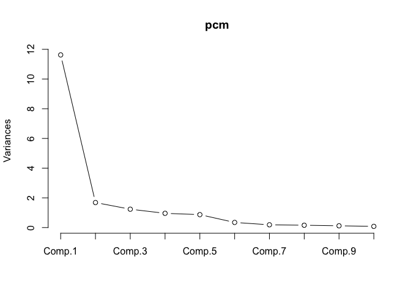
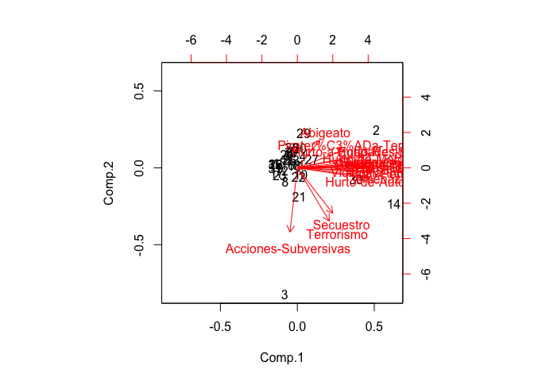

Carguemos los datos que hemos obtenido en el script anterior

    dt <- readRDS("dta/datos-criminalidad.RDS")

Hemos visto en los scripts anteriores cómo agrupar observaciones que son
similares. Nuestro objetivo ahora es agrupar *dimensiones* de tal forma
que podamos representar nuestros datos utilizando menos *variables*.

    pcm <- princomp(scale(dt))
    summary(pcm)

    ## Importance of components:
    ##                        Comp.1 Comp.2 Comp.3 Comp.4 Comp.5 Comp.6 Comp.7
    ## Standard deviation      3.409 1.2976 1.1118  0.979 0.9324 0.5875 0.4298
    ## Proportion of Variance  0.667 0.0966 0.0709  0.055 0.0499 0.0198 0.0106
    ## Cumulative Proportion   0.667 0.7631 0.8340  0.889 0.9388 0.9586 0.9692
    ##                         Comp.8  Comp.9 Comp.10 Comp.11 Comp.12 Comp.13
    ## Standard deviation     0.39506 0.34488 0.28264 0.27891 0.19319 0.15838
    ## Proportion of Variance 0.00895 0.00682 0.00458 0.00446 0.00214 0.00144
    ## Cumulative Proportion  0.97817 0.98499 0.98957 0.99403 0.99617 0.99761
    ##                         Comp.14  Comp.15  Comp.16  Comp.17  Comp.18
    ## Standard deviation     0.130532 0.105190 0.104502 4.01e-02 3.21e-02
    ## Proportion of Variance 0.000977 0.000635 0.000626 9.24e-05 5.91e-05
    ## Cumulative Proportion  0.998588 0.999222 0.999849 1.00e+00 1.00e+00

Podemos extraer los coeficientes asociados a cada una de las dimensiones
para interpretar en qué sentido se agrupan los diferentes componentes:

    pcm$loadings

    ## 
    ## Loadings:
    ##                               Comp.1 Comp.2 Comp.3 Comp.4 Comp.5 Comp.6
    ## Abigeato                              0.265 -0.425  0.271  0.732       
    ## Acciones-Subversivas                 -0.619 -0.329  0.271        -0.516
    ## Amenazas                       0.255         0.216         0.268  0.183
    ## Delitos-Sexuales               0.283         0.130               -0.108
    ## Extorsi%C3%B3n                 0.258        -0.195 -0.125  0.126       
    ## Homicidios                     0.264        -0.148 -0.293              
    ## Hurto-a-Entidades-Financieras  0.237  0.128         0.255 -0.301 -0.355
    ## Hurto-Comercio                 0.278                0.128        -0.185
    ## Hurto-de-Automotores           0.266 -0.106  0.154 -0.181              
    ## Hurto-de-Celulares             0.281                                   
    ## Hurto-de-Motocicletas          0.256        -0.282 -0.149 -0.186       
    ## Hurto-Personas                 0.272         0.270                     
    ## Hurto-Residencias              0.270  0.127         0.141        -0.217
    ## Lesiones-Personales            0.281         0.114                     
    ## Pirater%C3%ADa-Terrestre       0.172  0.171 -0.498  0.192 -0.449  0.293
    ## Secuestro                      0.130 -0.437 -0.292 -0.555              
    ## Terrorismo                     0.117 -0.512  0.103  0.486         0.591
    ## Violencia-Intrafamiliar        0.276         0.211               -0.105
    ##                               Comp.7 Comp.8 Comp.9 Comp.10 Comp.11 Comp.12
    ## Abigeato                       0.112                       -0.259         
    ## Acciones-Subversivas          -0.110 -0.186  0.206          0.225         
    ## Amenazas                       0.450               -0.217   0.463  -0.122 
    ## Delitos-Sexuales                     -0.121                 0.135         
    ## Extorsi%C3%B3n                -0.264  0.742  0.268          0.304   0.194 
    ## Homicidios                           -0.365  0.309                  0.294 
    ## Hurto-a-Entidades-Financieras  0.660  0.250  0.161         -0.275         
    ## Hurto-Comercio                -0.234  0.129 -0.221         -0.143  -0.162 
    ## Hurto-de-Automotores          -0.217         0.400 -0.396  -0.500         
    ## Hurto-de-Celulares                   -0.194 -0.138  0.414           0.620 
    ## Hurto-de-Motocicletas                        0.180  0.578          -0.606 
    ## Hurto-Personas                -0.135                       -0.170         
    ## Hurto-Residencias             -0.281        -0.512                        
    ## Lesiones-Personales                  -0.294                 0.154  -0.106 
    ## Pirater%C3%ADa-Terrestre             -0.104 -0.135 -0.495   0.164         
    ## Secuestro                      0.247  0.122 -0.453         -0.264         
    ## Terrorismo                            0.120         0.157  -0.161         
    ## Violencia-Intrafamiliar                                     0.168  -0.225 
    ##                               Comp.13 Comp.14 Comp.15 Comp.16 Comp.17
    ## Abigeato                              -0.135                         
    ## Acciones-Subversivas                                  -0.122         
    ## Amenazas                       0.365   0.220  -0.206  -0.247         
    ## Delitos-Sexuales              -0.291  -0.490  -0.482   0.224  -0.139 
    ## Extorsi%C3%B3n                -0.136                          -0.128 
    ## Homicidios                             0.349  -0.186   0.435   0.338 
    ## Hurto-a-Entidades-Financieras          0.126                         
    ## Hurto-Comercio                 0.372  -0.109  -0.400   0.177         
    ## Hurto-de-Automotores           0.224           0.180          -0.312 
    ## Hurto-de-Celulares             0.368  -0.247   0.190  -0.174  -0.191 
    ## Hurto-de-Motocicletas          0.108                  -0.155         
    ## Hurto-Personas                -0.291          -0.112  -0.612   0.553 
    ## Hurto-Residencias                      0.563                         
    ## Lesiones-Personales           -0.540   0.101   0.238          -0.482 
    ## Pirater%C3%ADa-Terrestre              -0.149          -0.172         
    ## Secuestro                     -0.126  -0.136                         
    ## Terrorismo                                             0.207         
    ## Violencia-Intrafamiliar               -0.318   0.612   0.358   0.397 
    ##                               Comp.18
    ## Abigeato                             
    ## Acciones-Subversivas                 
    ## Amenazas                             
    ## Delitos-Sexuales              -0.477 
    ## Extorsi%C3%B3n                       
    ## Homicidios                     0.149 
    ## Hurto-a-Entidades-Financieras        
    ## Hurto-Comercio                 0.584 
    ## Hurto-de-Automotores          -0.210 
    ## Hurto-de-Celulares                   
    ## Hurto-de-Motocicletas                
    ## Hurto-Personas                       
    ## Hurto-Residencias             -0.405 
    ## Lesiones-Personales            0.417 
    ## Pirater%C3%ADa-Terrestre             
    ## Secuestro                            
    ## Terrorismo                           
    ## Violencia-Intrafamiliar              
    ## 
    ##                Comp.1 Comp.2 Comp.3 Comp.4 Comp.5 Comp.6 Comp.7 Comp.8
    ## SS loadings     1.000  1.000  1.000  1.000  1.000  1.000  1.000  1.000
    ## Proportion Var  0.056  0.056  0.056  0.056  0.056  0.056  0.056  0.056
    ## Cumulative Var  0.056  0.111  0.167  0.222  0.278  0.333  0.389  0.444
    ##                Comp.9 Comp.10 Comp.11 Comp.12 Comp.13 Comp.14 Comp.15
    ## SS loadings     1.000   1.000   1.000   1.000   1.000   1.000   1.000
    ## Proportion Var  0.056   0.056   0.056   0.056   0.056   0.056   0.056
    ## Cumulative Var  0.500   0.556   0.611   0.667   0.722   0.778   0.833
    ##                Comp.16 Comp.17 Comp.18
    ## SS loadings      1.000   1.000   1.000
    ## Proportion Var   0.056   0.056   0.056
    ## Cumulative Var   0.889   0.944   1.000

La cuestión restante es ver cuántas dimensiones mantener para poder
representar los datos con la menor pérdida. Podemos observar las
varianzas asociadas a cada dimensión y comprobar el descenso marginal
asociada a cada componente añadido.

    plot(pcm, type="l")

En este caso, la tercera dimensión apenas reduce la varianza acumulada y
con solo dos dimensiones podemos representar los datos con un 76% de
precisión. Dado eso, podemos interpretar los resultados usando `biplot`:

    biplot(pcm)

que se corresponde con los pesos y dirección de los componentes tal y
como vemos aquí:

    as.matrix(pcm$loadings[, 1:2])

    ##                                Comp.1   Comp.2
    ## Abigeato                       0.0821  0.26484
    ## Acciones-Subversivas          -0.0270 -0.61862
    ## Amenazas                       0.2550 -0.08210
    ## Delitos-Sexuales               0.2826  0.00547
    ## Extorsi%C3%B3n                 0.2583  0.02022
    ## Homicidios                     0.2642 -0.00564
    ## Hurto-a-Entidades-Financieras  0.2372  0.12822
    ## Hurto-Comercio                 0.2781  0.04295
    ## Hurto-de-Automotores           0.2664 -0.10555
    ## Hurto-de-Celulares             0.2813  0.04432
    ## Hurto-de-Motocicletas          0.2559  0.07139
    ## Hurto-Personas                 0.2715 -0.04830
    ## Hurto-Residencias              0.2696  0.12724
    ## Lesiones-Personales            0.2810  0.02679
    ## Pirater%C3%ADa-Terrestre       0.1724  0.17149
    ## Secuestro                      0.1296 -0.43749
    ## Terrorismo                     0.1167 -0.51207
    ## Violencia-Intrafamiliar        0.2763 -0.03483

¿Cuál es la representación de los datos bajo los componentes que
acabamos de calcular?

    as.matrix(scale(dt)) %*% as.matrix(pcm$loadings[, 1:2])

    ##        Comp.1   Comp.2
    ##  [1,] -2.6896  0.19635
    ##  [2,]  9.8853  1.80433
    ##  [3,] -1.5860 -6.04269
    ##  [4,]  0.6894  0.57051
    ##  [5,] -0.6076  0.76370
    ##  [6,] -0.9400  0.69235
    ##  [7,] -1.5488  0.37393
    ##  [8,] -1.5101 -0.65337
    ##  [9,] -1.3267  0.43427
    ## [10,]  0.4174 -0.33813
    ## [11,]  0.0479  0.12572
    ## [12,] -1.9793 -0.14509
    ## [13,] -0.5533  0.37056
    ## [14,] 12.0939 -1.73638
    ## [15,] -2.8125  0.17553
    ## [16,] -1.2090  0.13046
    ## [17,] -2.5675 -0.22441
    ## [18,] -0.3618  0.08362
    ## [19,] -0.7680  0.80140
    ## [20,]  0.2808  0.94652
    ## [21,]  0.2189 -1.38904
    ## [22,]  0.1537 -0.43284
    ## [23,] -2.2128 -0.34230
    ## [24,] -1.2870  0.62423
    ## [25,] -0.9641  0.36618
    ## [26,] -2.6661  0.18745
    ## [27,]  1.8386  0.41838
    ## [28,] -0.6667  0.96706
    ## [29,]  0.7857  1.65223
    ## [30,]  7.3796 -0.56175
    ## [31,] -2.7673 -0.00335
    ## [32,] -2.7671  0.18459

Podemos comprobar que con el nuevo índice las observaciones que hemos
detectado antes que tenían un patrón de criminalidad diferenciado
vuelven a destacarse.
